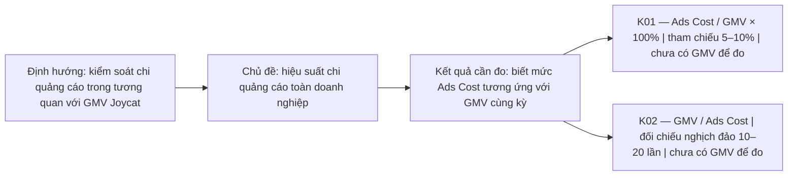

# KPI Tree Joycat — Ad_Cost_GMV_all_platform v3

> Bản sửa 3.3 · 11/09/2026 · Đây là cây chỉ số kinh doanh của case Joycat, không phải [KPI Tree thành công của toàn dự án](../project/KPI_TREE.md).

## 1. Cây này đo kết quả gì?

**Kết quả cần theo dõi: mức chi quảng cáo so với quy mô GMV toàn Joycat.** KPI chính là tỷ lệ Ads Cost/GMV. Mốc 5–10% là giả định làm việc Duy đã chốt, chưa phải kết quả đo thực tế và chưa phải tiêu chuẩn đạt/kém áp cho từng Campaign.

File cũ đã có tên KPI gốc, nhưng chủ yếu liệt kê input và công thức. Bản này bổ sung kết quả cần đo, định nghĩa, đơn vị, mốc tham chiếu, owner và điều kiện đọc. Không nâng mọi raw metric thành KPI.

## 2. Cây chỉ số kinh doanh Joycat

Cấu trúc trên là cách trình bày mục tiêu đo lường đã có trong Context, không phải chiến lược tăng trưởng mới do AI tự phê duyệt. K02 là dạng đọc tương đương của K01, **không phải một thành tích độc lập**.

## 3. Hợp đồng một tỷ lệ và cách đọc nghịch đảo

| Thuộc tính | K01 — Tỷ lệ Ads Cost/GMV | K01-R — Cách đọc nghịch đảo: Business ROAS |
|---|---|---|
| Đo điều gì? | Mỗi 100 đồng GMV đi cùng bao nhiêu đồng Ads Cost | Mỗi đồng Ads Cost đi cùng bao nhiêu đồng GMV |
| Công thức | Tổng Ads Cost / GMV toàn nền tảng × 100% | GMV toàn nền tảng / Tổng Ads Cost |
| Đơn vị | % | Lần |
| Mốc tham chiếu | 5–10%, giả định Duy chốt | 10–20 lần, suy ra từ cùng giả định |
| Kỳ/cấp | Tháng 03, 04, 05/2026; tổng Joycat theo từng tháng | Cùng scope với K01 |
| Nguồn chi phí | Amount spent, một cấp export được chọn; Mapping/Coverage §3 quản lý đối soát | Như K01 |
| Nguồn GMV | Đơn/GMV business đa kênh, cùng kỳ; chưa được cung cấp | Như K01, không dùng Purchase Value Meta |
| Trạng thái | Một phần: có Ads Cost; thiếu GMV nên chưa tính KPI thật | Chưa tính được vì thiếu GMV |
| Owner | Duy quản lý tài liệu; cậu Sinh/người phụ trách business chốt GMV và cách đánh giá | Cùng owner với K01 |
| Giới hạn | Không chứng minh lợi nhuận hay toàn bộ GMV do Ads tạo ra; GMV phải lớn hơn 0 | Ads Cost phải lớn hơn 0; không phải ROAS attribution do Meta báo cáo |

Nếu `r = Ads Cost / GMV` là tỷ lệ dạng số thập phân thì `r = 1 / ROAS`. Khi hiển thị theo %, dùng `(1 / ROAS) × 100%`. Không viết số phần trăm và tỷ lệ thập phân lẫn nhau.

## 4. Chỉ số hỗ trợ: không tự có target vì nằm trên Tree

Các metric dưới đây giúp đọc KPI tổng theo từng nhiệm vụ. Chỉ gọi là KPI vận hành của một case khi owner chốt kết quả cần đạt và cách đánh giá; hiện là **ứng viên**, không tự gán ngưỡng.

| Mã / kết quả cần kiểm tra | Chỉ số và công thức định nghĩa | Đơn vị; trạng thái theo audit hiện có | Mốc đánh giá / điều kiện |
|---|---|---|---|
| M01 — Theo dõi mức chi | Ads Cost = tổng Amount spent | VND; có | So với ngân sách được duyệt; chưa có ngân sách business chốt cho case |
| M02 — Chi phí phân phối | CPM = Ads Cost / Impressions × 1.000 | VND/1.000 lượt; tính được | Owner chọn nhóm so sánh cùng nhiệm vụ; không gắn CPM cao với ROAS kém |
| M03 — Chi phí nhấp | CPC all = Ads Cost / Clicks all; CPC link = Ads Cost / Link Clicks | VND/lượt; preferred thiếu click theo audit | Tách all/link; chưa chốt target |
| M04 — Chi phí đúng loại kết quả | CPR loại r = Ads Cost đúng scope / Results loại r | VND/kết quả; có điều kiện | Cùng indicator, attribution và phạm vi chi phí; không trộn các Results |
| M05 — Chi phí hội thoại | Ads Cost / Messaging Conversations Started | VND/hội thoại; có một phần | Phải đọc chất lượng hội thoại khi có dữ liệu; chưa chốt target |
| M06 — Chi phí liên hệ mới | Ads Cost / New Messaging Contacts | VND/liên hệ; có một phần | Không đồng nghĩa người mua; chưa chốt target |
| M07 — Chi phí mỗi Purchase Meta-attributed | Ads Cost cùng scope / `meta_purchases_attributed` cùng scope và attribution | VND/kết quả Meta; có một phần | Không thay chi phí mỗi `business_orders_eligible`; chưa chốt target |

Mọi phép chia cần mẫu số dương. Kỳ mặc định theo export tháng và một grain đã chọn; dữ liệu thiếu hoặc null không tự là 0. Nguồn định nghĩa các input và trạng thái ở [Dictionary](../../01_inputs/joycat/DATA_DICTIONARY_JOYCAT.md); nguồn từng file/sheet/cặp ở [Mapping/Coverage](DATA_MAPPING_COVERAGE_JOYCAT.md). Duy/cậu Sinh hoặc owner vận hành là người chốt target còn thiếu, không phải AI.

Reach, Impressions, Frequency, CTR, Post Engagements, Orders Created/Dispatched và Purchase Value Meta của bản cũ vẫn là input/metric đối chiếu được giữ trong mindmap. Không cộng CPM/CPC/CPR vào Ads Cost. Chi tiết công thức dùng [Metric Tree](METRIC_TREE.md) và [Bộ 5 Metrics](CONG_THUC_5_METRICS_JOYCAT_v3.md).

## 5. Bốn chiều chỉ là cách xem KPI

- Nền tảng hiển thị, sản phẩm, phễu và objective là dimension, không phải KPI và không tự có target 5–10%.
- Tách chi phí thành bốn nhóm là bốn cách nhìn cùng một khoản tiền; không cộng tổng của bốn cách nhìn với nhau.
- Chỉ tính Ads Cost/GMV cho một nhóm khi cả tiền và GMV được ánh xạ cùng nhóm. `Ads Cost Facebook / GMV toàn Joycat` là phần đóng góp chi phí vào tỷ lệ tổng, **không phải** tỷ lệ chi phí/GMV riêng Facebook.
- Các nhóm phải không đếm trùng và bao phủ đủ phạm vi; giữ phần Shared/Unknown khi chưa phân bổ được. Không tự điền WhatsApp làm publisher từ destination.
- Bản v3 có cả cặp 2/cặp 3: giữ lại làm tham khảo lịch sử trong mindmap, không có nghĩa dữ liệu đã hỗ trợ hoặc phase đã mở phân tích cặp 3.

## 6. Đường đọc và nguồn chính

| Cần hiểu gì? | Mở tài liệu |
|---|---|
| Mục tiêu toàn workspace | [Workspace Context](../../context/WORKSPACE_CONTEXT.md) |
| Việc đang được phép làm | [Current Intent](../../context/CURRENT_INTENT.md) |
| Facts, giả định và người xác nhận Joycat | [Context Joycat](../../01_inputs/joycat/context.md) |
| Từng trường dữ liệu nghĩa là gì | [Data dictionary — input](../../01_inputs/joycat/DATA_DICTIONARY_JOYCAT.md) |
| KPI được tính ra sao | [Metric Tree](METRIC_TREE.md) |
| Công thức và cách kiểm tra theo bối cảnh | [Bộ 5 Metrics](CONG_THUC_5_METRICS_JOYCAT_v3.md) |
| File/sheet/cột, mapping và cặp nào làm được | [Data Mapping & Coverage](DATA_MAPPING_COVERAGE_JOYCAT.md) |
| Xem dạng cây | [Mindmap KPI v3 đã sửa](Ad_Cost_GMV_all_platform%20v3.mm) |

KPI thành công của dự án nằm riêng tại [`01_inputs/project/KPI_TREE.md`](../project/KPI_TREE.md). Các nhánh cũ trong v3 được giữ ở mục tham khảo thu gọn, không dùng để ghi đè định nghĩa mới.

## 7. Điều gì còn phải chốt?

- **GMV — To be updated:** Cậu Sinh/owner business xác nhận danh sách kênh, kỳ ghi nhận, quy tắc hoàn/hủy và đếm trùng. Thiếu phần này chặn tính KPI thật, không chặn thiết kế Tree.
- **KPI vận hành — To be updated:** Duy/cậu Sinh chốt mục tiêu từng case và nhóm so sánh trước khi chọn M02–M07 làm KPI. Không cần đặt target giả chỉ để làm đầy file.
- **Review:** Bản sửa để người dùng xem; chưa coi cậu Sinh đã phê duyệt và chưa mở quyền ETL/report.

## 8. Correlation nằm ở bước nào?

Correlation không phải một nhánh KPI mới. Sau khi Duy chọn câu hỏi, AI phải tra [Data Dictionary](DATA_DICTIONARY_JOYCAT.md) và [Mapping/Coverage mục 9.4](DATA_MAPPING_COVERAGE_JOYCAT.md) để xác định cặp biến có ETL được hay không.

- Nếu là `Categorical × Numerical`, ví dụ Objective × CPM, trước hết so sánh CPM giữa các nhóm Objective cùng grain/kỳ/scope; không gọi là Pearson correlation.
- Nếu là `Numerical × Numerical`, ví dụ CPM × CTR, chỉ kiểm tra association/correlation khi có đủ quan sát cùng grain và phải ghi rõ nếu quan hệ bị tạo sẵn bởi công thức.
- Dù thấy correlation, chưa được kết luận nguyên nhân, tốt/xấu hoặc ROAS thay đổi nếu chưa xét case, phễu, sản phẩm, objective, publisher, attribution và GMV business cùng phạm vi.

Nói ngắn: “KPI chính của mình là tiền Ads trên GMV. 5–10% là mốc giả định. CPM, click, mess… giúp kiểm tra từng phần, nhưng chưa đủ để kết luận KPI tổng nếu thiếu GMV và bối cảnh.”
