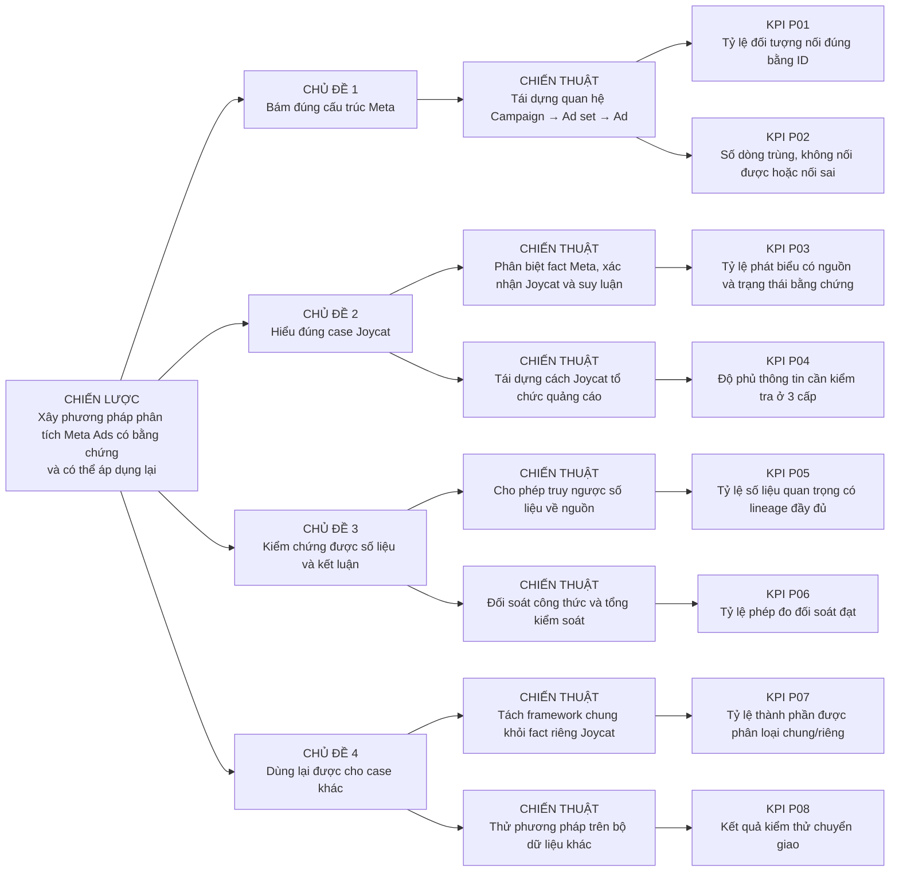

# KPI Tree của dự án Meta Agentic BA

> Phiên bản: 1.1  
> Cập nhật: 2026-09-11  
> Người xây và đề xuất: Duy  
> Người duyệt mục tiêu, mức KPI và chuyển bước: cậu Sinh  
> Trạng thái: Bản nháp để review; mọi ngưỡng chưa được cậu Sinh duyệt đều ghi `Chưa chốt`.

## 1. Cây này dùng để đo gì?

Cây này đo **dự án có tạo được một phương pháp phân tích Meta Ads đúng cấu trúc, có bằng chứng và dùng lại được hay không**. Nó không thay cho [cây chỉ số kinh doanh Joycat](../joycat/Ad_Cost_GMV_all_platform%20v3.md).

Joycat là case học và kiểm thử đầu tiên. Giả định `Ads Cost / GMV = 5–10%` thuộc case Joycat, không phải KPI thành công của toàn dự án.

## 2. KPI Tree bốn tầng



## 3. Hợp đồng KPI

| KPI | Kết quả được đo | Công thức sơ bộ | Kỳ và grain | Nguồn | Readiness | Mức cần đạt |
|---|---|---|---|---|---|---|
| P01 — Tỷ lệ đối tượng nối đúng bằng ID | Tái dựng đúng hierarchy Meta | Số object nối đúng cha-con bằng ID / Tổng object cần nối | Theo đợt kiểm tra; Campaign/Ad set/Ad | Meta export có ID | Một phần; preferred export thiếu một số ID cha-con | Chưa chốt |
| P02 — Số dòng lỗi nối | Phát hiện lỗi cấu trúc | Count dòng duplicate + unmatched + ambiguous join | Theo source, kỳ và entity level | Báo cáo validation | Có thiết kế; chưa chạy lại sau sửa | Chưa chốt |
| P03 — Tỷ lệ phát biểu có bằng chứng | Không biến suy luận thành fact | Số phát biểu có source + evidence status / Tổng phát biểu cần kiểm tra | Theo artefact/review | Context, mapping, review log | Một phần | Chưa chốt |
| P04 — Độ phủ thông tin ba cấp | Hiểu cách Joycat setup Ads | Số trường bắt buộc đã có nguồn hoặc owner xác nhận / Tổng trường bắt buộc | Campaign, Ad set, Ad | Data Dictionary + source inventory | Một phần | Chưa chốt |
| P05 — Tỷ lệ số liệu có lineage | Truy ngược số liệu | Số measure quan trọng có file/sheet/row/period/formula/version / Tổng measure quan trọng | Theo measure/report cell | Mapping contract + model metadata | Chưa sẵn có report | Chưa chốt |
| P06 — Tỷ lệ phép đo đối soát đạt | Kiểm chứng tính toán | Số check PASS / Tổng check đã chạy; không tính check chưa chạy là PASS | Theo validation run | Validator và control totals | Một phần | Chưa chốt |
| P07 — Tỷ lệ thành phần chung/riêng được phân loại | Không bê fact Joycat sang case khác | Số rule/field/mapping có nhãn `Meta chung` hoặc `Joycat riêng` / Tổng thành phần cần chuyển giao | Theo artefact | Context + Data Dictionary | Một phần | Chưa chốt |
| P08 — Kết quả kiểm thử chuyển giao | Chứng minh khả năng dùng lại | Bộ tiêu chí do cậu Sinh duyệt sau khi thử trên ít nhất một case khác | Theo case | Case đích + biên bản review | Chưa sẵn có | Chưa chốt |

## 4. Quan hệ với bộ Joycat

```text
KPI Tree dự án
→ đo chất lượng phương pháp và bằng chứng

Cây chỉ số kinh doanh Joycat
→ Ads Cost / GMV business (giả định học tập 5–10%)
→ là một case dùng để kiểm thử phương pháp
```

Campaign, Ad set, Ad, Objective, Phễu, Sản phẩm và Nền tảng là cấu trúc vận hành hoặc dimension. Chúng không tự trở thành tầng KPI.

## 4.1. K60 được dùng ở đâu?

K60 cung cấp phương pháp đặt câu hỏi, phân rã vấn đề, làm Data Dictionary, kiểm tra EDA và trình bày bằng chứng. K60 **không cung cấp target** cho P01–P08 và không xác minh cách Joycat setup quảng cáo.

Khi Duy muốn kiểm nghiệm một cặp biến, KPI Tree chỉ cho biết việc đó phục vụ kết quả nào của dự án. Data Dictionary và Mapping/Coverage mới quyết định cặp đó có field, grain, source và join đủ để ETL hay không. Kết quả correlation không tự chứng minh KPI dự án đạt.

## 5. Hard gate

- [x] Tách mục tiêu dự án khỏi chỉ số kinh doanh Joycat.
- [x] Có đúng bốn tầng: Chiến lược → Chủ đề → Chiến thuật → KPI.
- [x] Mỗi KPI có mục đích, công thức sơ bộ, nguồn và readiness.
- [x] Không tự đặt target số.
- [ ] Cậu Sinh duyệt mục tiêu và mức cần đạt.
- [ ] Thử phương pháp trên ít nhất một case khác.

Kết luận: cấu trúc Tree đã được dựng; **chưa được coi là KPI Tree đã duyệt**.
