# Context Joycat

> Phiên bản: 9.0  
> Cập nhật: 2026-09-05  
> Trạng thái: Đã gộp Context–Logic–Mapping vào Logic Tree v2.0 để review; chưa kết luận hiệu quả Joycat và chưa chuyển ETL/report production

## 1. AI dùng context này như thế nào

Đọc file này khi Joycat là trường hợp đang được xử lý. Đây là nguồn bối cảnh cho KPI 1: mục tiêu, hiện trạng vận hành, danh mục nguồn, trạng thái bằng chứng, hợp đồng Tree và mức kết luận được phép.

Không dùng file này làm Context Truther. Không dùng tên Campaign, thư mục hoặc cột được tạo thêm để tự xác nhận ý nghĩa nghiệp vụ.

## 2. Bối cảnh mục tiêu (Objective Context) — KPI 1

Câu hỏi cần trả lời:

> Với bộ chỉ số, cấu trúc Campaign → Ad set → Ad, phễu, LAL và logic chuyển đổi quan sát được trong dữ liệu Meta Ads tháng 03–05/2026, phát biểu `Ads Cost / GMV toàn nền tảng khoảng 5–10%` có thể được giải thích là khả thi về mặt cơ chế như thế nào?

Joycat là trường hợp học để Duy cùng AI:

- đọc đúng cấu trúc Meta Ads;
- nối chỉ số vận hành với kết quả kinh doanh;
- phân biệt thông tin có nguồn, lời xác nhận của người phụ trách, suy luận và phần chưa biết;
- xây KPI Tree, Metric Tree và Logic Tree có bằng chứng;
- học phương pháp ra quyết định có thể chuyển sang trường hợp khác.

KPI 1 không yêu cầu tái tính hoặc chứng minh chính xác tỷ lệ 5–10% khi chưa có GMV/đơn hàng đa nền tảng cùng kỳ.

## 3. Mong muốn thực tế của giai đoạn hiện tại

- Nối KPI cần xem → công thức Metric Tree → bốn chiều/sáu cặp/coverage → đường đi Logic Tree trong một bộ đọc chính.
- Làm rõ Nền tảng, Sản phẩm, Phễu và Campaign objective đủ để AI sau này thiết kế ETL đúng grain và báo phần dataset chưa đáp ứng.
- Giữ Logic Duy đã làm làm nền, bổ sung data gate, lát cắt, bằng chứng xác nhận/phản bác và giới hạn.
- Dừng ở `03_outputs\joycat\LOGIC_TREE.md/.mm` để Duy/cậu Sinh review.
- Chưa triển khai ETL/report production, chưa phân bổ chi phí dùng chung và chưa kết luận nguyên nhân/hiệu quả.

## 4. Bối cảnh vận hành hiện tại (Current Operating Context)

- Duy không làm tại Joycat và không sở hữu đầy đủ dữ liệu kinh doanh/đơn hàng.
- Cậu Sinh là người đánh giá chuyên môn và là nguồn xác nhận thông tin nghiệp vụ được Duy thuật lại.
- Dữ liệu gốc duy nhất được tham chiếu nằm tại `D:\Meta Agentic BA\01_inputs\joycat\raw`.
- Kỳ phân tích ưu tiên là tháng 03–05/2026; một số tệp Excel chỉ có tháng 03–04.
- Chưa có quy trình tự động, tích hợp Ads API, mô hình dữ liệu hoặc báo cáo Power BI cho Joycat.

Luồng sau khi Context được duyệt:

```mermaid
flowchart LR
    A[Context Joycat được duyệt] --> B[KPI Tree skill + Tree v1]
    B --> C[Kiểm định KPI Tree]
    C --> D[Metric Tree skill + Tree v1]
    D --> E[Kiểm định Metric Tree]
    E --> F[Logic Tree skill + Tree v1]
    F --> G[Kiểm định Logic Tree]
    G --> H[Duy trình bày ba Tree và giới hạn]
    H --> I[Cậu Sinh đánh giá giai đoạn xây Tree]
    I --> J[Kiểm tra nguồn và phân tích đầy đủ]
    J --> K[Trả lời KPI 1]
```

## 5. Thông tin nghiệp vụ và bằng chứng

| Phát biểu | Trạng thái | Giới hạn |
|---|---|---|
| Joycat bán cát mèo | Người phụ trách đã xác nhận qua Duy | Chưa đối chiếu danh mục sản phẩm trong workspace |
| Joycat bán đa sàn thương mại (gồm Shopee) và có shop trực tiếp; không chỉ một sàn | Cậu Sinh xác nhận qua Duy — 2026-08-26/27 | Chưa có hợp đồng dữ liệu liệt kê đầy đủ sàn và quy tắc cộng GMV |
| Joycat chỉ chạy Ads trên Meta; không có kênh Ads nào khác song song | Cậu Sinh xác nhận qua Duy — 2026-08-26/27 | Chưa xác nhận thời điểm bắt đầu và khả năng thay đổi trong tương lai |
| Purchase = Order trong Joycat: 1 order tương ứng 1 purchase | Cậu Sinh xác nhận qua Duy — 2026-08-26/27 | Chưa xác nhận ngoại lệ (đơn bị tách, hoàn/hủy, đơn nhiều SKU) |
| ROAS do Meta báo cáo khác với ROAS business mà cậu Sinh sử dụng | Cậu Sinh xác nhận qua Duy — 2026-08-26/27 | Công thức ROAS business chưa được khai báo cụ thể; To be updated |
| Ads Cost / GMV toàn nền tảng khoảng 5–10% | Cậu Sinh xác nhận qua Duy | Chưa được dữ liệu hiện có xác minh |
| TOFU hướng tới View; MOFU/BOFU hướng tới chuyển đổi | Người phụ trách đã xác nhận qua Duy | Sự kiện cụ thể phải đọc theo từng Campaign/Ad set |
| Tên LAL phản ánh View, Mess, Purchase hoặc số điện thoại người mua | Người phụ trách đã xác nhận; tên gọi quan sát được trong dữ liệu | Chưa có nguồn cho quy tắc tạo tệp và điều kiện loại trừ |

### 5.1. Bản đồ yếu tố cần làm rõ

Các yếu tố trong bảng này được phân luồng tới đúng artefact. Việc một yếu tố “có thể ảnh hưởng” chỉ là giả thuyết, không phải bằng chứng rằng nó đã làm thay đổi hiệu quả Joycat.

| Yếu tố | Ảnh hưởng có thể có | Nơi sử dụng | Nguồn hiện có | Trạng thái | Owner/nguồn cần hỏi | Giới hạn |
|---|---|---|---|---|---|---|
| Sản phẩm, giá và quy cách cát mèo | Quyết định nhu cầu, giá trị đơn và chu kỳ mua lại | Context; KPI/Logic Tree khi liên quan | Duy/cậu Sinh xác nhận sản phẩm là cát mèo | Một phần | Người phụ trách Joycat | Chưa có danh mục, giá hoặc quy cách trong workspace |
| Chu kỳ mua lại và lý do chọn Joycat | Ảnh hưởng nhu cầu lặp lại, retention và timing | Context; Logic Tree | Không có | To be updated | Người phụ trách khách hàng/Joycat | Không được tự giả định từ ngành hàng |
| Nhóm khách hàng | Ảnh hưởng audience, thông điệp và conversion | Context; bảng ánh xạ Meta | Tên audience/LAL trong export | Một phần | Người thiết kế audience | Tên LAL không chứng minh chân dung hoặc chất lượng khách |
| Các kênh tạo GMV | Xác định mẫu số GMV toàn nền tảng | KPI/Metric Tree; source contract | Owner xác nhận có sàn, Meta và điểm bán | Một phần | Cậu Sinh/người phụ trách dữ liệu | Chưa khóa đầy đủ danh sách kênh và rule cộng GMV |
| Giá, voucher, trợ giá, miễn phí vận chuyển | Có thể thay đổi conversion và GMV | Context; Logic Tree | Không có nguồn trực tiếp | To be updated | Joycat hoặc owner nền tảng | Không suy ra từ biến động Ads |
| Tồn kho, giao hàng và hoàn/hủy | Có thể giới hạn đơn, dispatched order và GMV thực | Context; Logic Tree; metric contract | Có trường Orders created/dispatched trong Meta | Một phần | Owner vận hành/đơn hàng | Ý nghĩa event, coverage và hoàn/hủy chưa xác nhận |
| Ngày lễ 30/4–1/5 | Có thể thay đổi thời gian rảnh và nhu cầu mua sắm | Sổ giả thuyết/Logic Tree | Tên Campaign có `Sale 30.4` | Đã xác minh từ nguồn: tên; Suy luận: tác động | Người vận hành Campaign; nguồn lịch/sale | Export hiện gộp tháng, không đo tác động riêng theo ngày |
| Sale 3.3, 4.4, 5.5 hoặc sale riêng | Có thể thay đổi traffic, ưu đãi và conversion | Sổ giả thuyết/Logic Tree | Tên Campaign có `4/4 - SALE`; `D_SALEDAY.xlsx` | Một phần | Owner sàn/Campaign | Nhãn Shopee/TikTok trong file lịch đang trống ở giai đoạn 2026 đã kiểm tra |
| Cuối tuần, ngày lương và thời điểm trong tháng | Có thể ảnh hưởng sức mua | Sổ giả thuyết/Logic Tree | Không có dữ liệu theo ngày | Suy luận | Nguồn lịch và dữ liệu daily nếu có về sau | Không bắt buộc xin data chỉ để kiểm tra giả thuyết này |
| Đối thủ, thời tiết, mùa vụ | Có thể thay đổi demand hoặc media auction | Sổ giả thuyết/Logic Tree | Không có | To be updated | Nguồn thị trường phù hợp | Chỉ dùng khi có cơ chế hợp lý và nguồn đủ mạnh |
| Objective và Result indicator Meta | Xác định loại kết quả mà Campaign/Ad set/Ad đang báo cáo | KPI Tree; source audit | Export có bốn indicator quan sát được: engagement, messaging, purchase, ad recall | Sẵn có | Meta export; owner xác nhận intent | Indicator quan sát được không tự chứng minh chiến lược kinh doanh |
| TOFU/MOFU/BOFU | Gợi ý vai trò trong phễu | Bảng ánh xạ cấu trúc; Logic Tree | Owner xác nhận vai trò cấp cao; tên Campaign quan sát được | Một phần | Người thiết kế Campaign | Phải kiểm tra từng objective/event; không dùng làm Tầng Chủ đề KPI Tree |
| Destination Messenger/Shopee/kênh khác | Xác định nơi conversion diễn ra và khả năng nối GMV | Context; bảng ánh xạ | Tên file/campaign và trường messaging/order | To be updated | Owner Campaign/data | `CPAS-SHOPEE` trong tên file chưa đủ xác nhận mọi destination |
| LAL, seed, tỷ lệ và exclusion | Ảnh hưởng audience quality và overlap | Bảng ánh xạ cấu trúc; Logic Tree | Tên LAL View, Mess, Purchase, SĐT quan sát được | Một phần | Người tạo audience | Chưa có seed rule, exclusion hoặc version |
| Budget, delivery và lần chỉnh sửa | Ảnh hưởng khả năng phân phối và so sánh hiệu quả | Bảng ánh xạ Meta; source audit | Có trường budget type, delivery, edit time | Sẵn có | Meta export | Dữ liệu tháng không cho thấy đầy đủ lịch sử thay đổi theo ngày |
| Attribution setting | Thay đổi phạm vi kết quả Meta ghi nhận | KPI/Metric Tree; source audit | Có 1-day click, 7-day click, 7-day click hoặc 1-day view | Sẵn có | Meta export; owner metric | Không so trực tiếp nếu setting khác nhau |
| Purchase/Orders/Purchase Value | Tạo tín hiệu chuyển đổi trong Meta | KPI Tree; source audit | Có trường trong export | Một phần | Owner tracking/data | Không đồng nghĩa toàn bộ đơn hoặc GMV business |
| Viết tắt `TT`, `TN`, `PFX`, `MNX`, `NA`, `CE8`, `TP`, `ADV` | Có thể mô tả format, sản phẩm, test hoặc audience | Bảng ánh xạ cấu trúc | Tồn tại trong tên Campaign/Ad set | To be updated | Người đặt tên Campaign | Không tự giải nghĩa từ tên |

### 5.2. Ranh giới thời gian và dữ liệu ngày

- Chín file `preferred_candidate` có `Reporting starts/ends` bao trọn từng tháng 03, 04 hoặc 05/2026; đây là dữ liệu tổng hợp theo tháng trong nguồn hiện tại.
- Tên Campaign `Sale 30.4` chứng minh Joycat có cách đặt tên gắn với sự kiện, không chứng minh ngày lễ làm tăng nhu cầu hoặc hiệu quả.
- `D_SALEDAY.xlsx` có ngày năm 2026 nhưng các nhãn Shopee/TikTok tại 30/4–1/5 đang trống trong lần kiểm tra này.
- Nếu về sau có dữ liệu theo ngày, có thể thiết kế cửa sổ trước–trong–sau sự kiện. Nếu không có, các yếu tố ngày chỉ nằm trong sổ giả thuyết.

## 6. Danh mục nguồn

Bộ dữ liệu gốc đã được kiểm kê gồm **33 file**: **32 tệp Excel `.xlsx`** và **1 tệp nén `.rar`**.

| Nhóm nguồn | Nội dung chính | Mức sẵn sàng | Giới hạn |
|---|---|---|---|
| `meta_ads/preferred_candidate` | 9 tệp Excel Campaign/Ad set/Ad, tháng 03–05/2026 | Sẵn có để kiểm tra nguồn | Tên thư mục chưa chứng minh đây là nguồn chính thức |
| `meta_ads/variants/dataset_xlsx` | 9 tệp Excel cùng ba cấp dữ liệu và 1 bảng ánh xạ/tổng quan | Một phần | Các cột được tạo thêm thiếu quy tắc và phiên bản |
| `meta_ads/variants/legacy_dataset` | Ad và Ad set tháng 03–04/2026 | Một phần | Thiếu Campaign và tháng 05 |
| `business_workbooks` | CPAS, tên đối tượng, Joycat-CS, ngày bán, định dạng quảng cáo và dữ liệu mạng xã hội | Một phần | Mỗi file có cấp dữ liệu và nguồn gốc khác nhau |
| `archives/dataset_xlsx.rar` | Tệp nén nguồn | Sẵn có nhưng chưa cần mở | Chỉ mở khi cần truy nguồn gốc |
| GMV/đơn hàng đa nền tảng | Không có trong workspace | Chưa sẵn có | Không thể tái tính KPI 5–10% |

### Cấp dữ liệu quan sát trong `preferred_candidate`

| Cấp dữ liệu | Tháng 03 | Tháng 04 | Tháng 05 | Số cột |
|---|---:|---:|---:|---:|
| Campaign | 58 dòng | 86 dòng | 95 dòng | 23 |
| Ad set | 78 dòng | 126 dòng | 148 dòng | 27 |
| Ad | 52 dòng | 94 dòng | 109 dòng | 30 |

Tệp Excel có dòng tổng ở đầu bảng nên số dòng trong file không đồng nghĩa số đối tượng. Campaign, Ad set và Ad là ba cấp dữ liệu khác nhau; không được cộng chéo cấp.

## 7. Hợp đồng sơ bộ về chỉ số và nguồn

| Đối tượng/chỉ số | Định nghĩa dùng trong KPI 1 | Nguồn và trạng thái |
|---|---|---|
| Campaign / Ad set / Ad | Ba cấp cấu trúc Meta Ads riêng biệt | Có tệp Excel theo từng cấp; nguồn chính thức `To be updated` |
| Ads Cost | Chi phí quảng cáo trong tài khoản, theo nguồn và kỳ xác định | Có trong tệp xuất từ Meta; trường dữ liệu cụ thể sẽ xác minh khi kiểm tra nguồn |
| Meta Purchase Value | Giá trị chuyển đổi theo cách Meta ghi nhận đóng góp | Có thể có trong tệp xuất; không đồng nghĩa GMV toàn nền tảng |
| GMV toàn nền tảng | GMV theo phạm vi nền tảng do doanh nghiệp định nghĩa, cùng kỳ | Chưa có nguồn hoặc hợp đồng dữ liệu |
| Results | Chỉ có nghĩa khi đi cùng `Result indicator` | Kiểm tra theo tệp Excel và cấp dữ liệu |
| LAL | Tệp đối tượng tương tự, gắn với tệp nguồn và điều kiện loại trừ | Có tên gọi; quy tắc tạo tệp `To be updated` |

## 8. Ba Tree v1 và hợp đồng đầu ra

Ba đầu ra là Tree cụ thể cho Joycat và chỉ dùng kiến thức Meta liên quan làm tài liệu tham khảo. Chúng không phải bản đồ toàn bộ kiến thức Meta và chưa phải kết luận KPI 1. Mỗi file phải có một Mermaid chính, phần kiểm định, kết quả đạt/chưa đạt, mức bao phủ và mục `To be updated`.

### KPI Tree

- Skill dự kiến: `.agents/skills/kpi-tree-skill/`.
- Đầu ra: `03_outputs/joycat/KPI_TREE.md`.
- Phải trả lời: cần lượng hóa những chỉ số cụ thể nào để đọc vấn đề Joycat?
- Không bắt buộc ép thành bốn tầng ROKS. Campaign → Ad set → Ad là grain/drill-down dữ liệu, không phải tầng KPI.
- Điều kiện đạt: chỉ số cụ thể, đúng phạm vi, nối được sang công thức Metric Tree và giữ metric chưa có dữ liệu thay vì xóa.

### Cây chỉ số (Metric Tree)

- Skill dự kiến: `.agents/skills/metric-tree-skill/`.
- Đầu ra: `03_outputs/joycat/METRIC_TREE.md`.
- Phải trả lời: từng KPI được tính bằng công thức nào và rẽ tới field gốc hoặc điểm nào không thể rẽ tiếp?
- Điều kiện đạt: ghi rõ công thức, đơn vị, source, grain, kỳ, attribution, trạng thái và điểm dừng.
- Không trộn số liệu ở cấp Campaign, Ad set và Ad; không dùng Meta Purchase Value thay GMV thật của doanh nghiệp.

### Logic Tree

- Skill dự kiến: `.agents/skills/logic-tree-skill/`.
- Đầu ra: `03_outputs/joycat/LOGIC_TREE.md`.
- Phải trả lời: cần đi qua câu hỏi, lát cắt, phép so sánh và bằng chứng nào để phân tích đúng từng case?
- Nút gốc đi từ Ads Cost/metrics theo bốn chiều; có data gate, kiểm soát tổng, funnel/journey, drill-down và giả thuyết kiểm tra.
- Mỗi giả thuyết phải nêu dữ liệu xác nhận và dữ liệu có thể bác bỏ; chưa đủ dữ liệu thì dừng ở trạng thái tương ứng.
- Không biến mối liên hệ quan sát được hoặc tên Campaign thành kết luận nhân quả.

Ba Tree dùng chung hợp đồng chỉ số và nguồn; không tự định nghĩa lại KPI hoặc thay giới hạn bằng chứng của Context này.

### Các lỗi khiến Tree không đạt

Giai đoạn xây Tree chưa đạt nếu:

- trộn mục đích của ba loại Tree;
- biến lời xác nhận của người phụ trách hoặc suy luận thành thông tin đã được dữ liệu chứng minh;
- trộn số liệu ở cấp Campaign, Ad set và Ad;
- đồng nhất Meta Purchase Value với GMV toàn nền tảng;
- xóa KPI hoặc chỉ số chỉ vì dữ liệu chưa sẵn có;
- có Mermaid nhưng thiếu phần kiểm định bắt buộc.

## 9. Điều kiện hoàn thành Tree v1

Giai đoạn xây Tree chỉ được trình cậu Sinh đánh giá khi:

- [ ] Ba skill đọc Workspace Context và Joycat Context trước khi tạo đầu ra.
- [ ] Ba đầu ra tồn tại đúng đường dẫn; mỗi file có một Mermaid chính và phần kiểm định tương ứng.
- [ ] KPI Tree lượng hóa đúng các chỉ số cụ thể cần xem và nối được sang công thức Metric Tree; không bắt buộc bốn tầng ROKS.
- [ ] Metric Tree ghi rõ công thức, nguồn, cấp dữ liệu và tình trạng của các chỉ số quan trọng.
- [ ] Logic Tree thể hiện đường đi phân tích, data gate, lát cắt và bằng chứng xác nhận/phản bác; bản mới phải được Duy/cậu Sinh review trước khi coi là đã duyệt.
- [ ] Không cần sửa tay nút gốc, tầng, quan hệ hoặc giới hạn bằng chứng sau khi skill tạo đầu ra; được phép chỉnh câu chữ và cách trình bày.
- [ ] Duy trình bày được mục đích, nút gốc, nhánh chính, ít nhất một giới hạn và bước tiếp theo của từng Tree.
- [ ] Cậu Sinh đánh giá tổng thể và chấp nhận giai đoạn xây Tree.

Hoàn thành giai đoạn xây Tree không đồng nghĩa KPI 1 đã hoàn thành.

## 10. Điều kiện hoàn thành KPI 1

KPI 1 chỉ được trình cậu Sinh đánh giá khi:

- [ ] Giai đoạn xây Tree đã được cậu Sinh chấp nhận.
- [ ] Việc kiểm tra nguồn đã chốt nguồn làm việc, kỳ dữ liệu, cấp dữ liệu và nguồn gốc.
- [ ] Mỗi con số có nguồn, cấp dữ liệu, kỳ dữ liệu và giới hạn.
- [ ] Campaign, Ad set và Ad không bị cộng hoặc so sánh sai cấp.
- [ ] Chỉ rõ cấu trúc/chỉ số nào hỗ trợ, không hỗ trợ hoặc chưa đủ để đánh giá lập luận.
- [ ] Meta Purchase Value và GMV thật của doanh nghiệp được tách rõ.
- [ ] 5–10% được ghi là lời xác nhận của người phụ trách và kết luận phù hợp về mặt cơ chế, không phải tỷ lệ đã tái tính.
- [ ] Duy trình bày được ba Tree, trả lời câu hỏi về nguồn/giới hạn và sửa theo phản hồi.
- [ ] Cậu Sinh đánh giá tổng thể và chấp nhận KPI 1.

Mức phát triển Duy hướng tới sau KPI 1: `L2` — làm cùng AI, hiểu và giải thích được đầu ra.

## 11. Mức sẵn sàng và phần cần cập nhật

| Câu hỏi/bước | Trạng thái | Mức kết luận được phép |
|---|---|---|
| Kiểm tra nguồn và cấu trúc dữ liệu | Sẵn có | Mô tả file, cấp dữ liệu, kỳ dữ liệu và tên gọi quan sát được |
| Phân tích phễu, LAL và chỉ số | Sẵn có có điều kiện | Phân tích kèm nguồn gốc và giới hạn |
| Giải thích cơ chế 5–10% | Sẵn có có điều kiện | Nêu kết luận phù hợp về mặt cơ chế; không chứng minh tỷ lệ thực tế |
| Tái tính chính xác 5–10% | Chưa sẵn có | Không được kết luận |

### Nguồn phân tích chính thức

Trạng thái: **To be updated**  
Thiếu: Người phụ trách chưa xác nhận nhóm tệp Excel chính thức.  
Người/nguồn xác nhận: Cậu Sinh hoặc người chuẩn bị bộ dữ liệu.  
Ảnh hưởng: Giới hạn khả năng truy nguồn gốc và tái tạo bảng ánh xạ.  
Câu hỏi tiếp theo: Bộ `preferred_candidate` có phải nguồn làm việc chính thức cho KPI 1 không?

### Kết quả kiểm tra dataset ngày 05/09/2026

- Bộ `preferred_candidate`: chín file Campaign/Ad set/Ad cho tháng 03–05/2026.
- Raw chưa có Campaign objective, Optimization/Performance goal, Publisher platform, Destination hoặc Product/SKU.
- File dẫn xuất `JOYCAT_CAMPAIGN_3_THANG_CO_CHI_PHI_OBJECTIVE_DEMO.xlsx` có 84 Campaign có spend và cột `Objective suy luận`.
- **Owner đã xác nhận — Duy, 2026-09-05:** `Objective suy luận` là mapping do Duy/con người can thiệp để bù field Objective bị thiếu và sẽ được dùng làm chiều phân tích trong ETL. Đây là nguồn vận hành hợp lệ cho ETL theo thiết kế của Duy, nhưng không được đổi nhãn thành Campaign objective do Meta export.
- Khi ETL phải giữ metadata tối thiểu: `objective_mapped`, `objective_mapping_basis`, `objective_mapping_version`, `mapped_by`, `mapped_at` và `review_status`. Campaign objective gốc từ Meta, nếu bổ sung sau, dùng để đối soát hoặc nâng cấp mapping chứ không chặn bước ETL hiện tại.
- Catalog có 25 Item ID dạng text; mapping Ads → sản phẩm hiện chỉ có thể suy luận cấp nhóm từ tên Campaign.
- Ba cặp có Nền tảng chưa tính được; ba cặp còn lại mới mapping suy luận/một phần.

Nguồn chi tiết hiện hành: `03_outputs\joycat\LOGIC_TREE.md`, trong đó đã gộp định nghĩa bốn chiều, sáu cặp, coverage, schema, yêu cầu export và hợp đồng ETL. Các file chi tiết cũ nằm trong archive để truy vết.

### GMV/đơn hàng đa nền tảng

Trạng thái: **To be updated**  
Thiếu: GMV/đơn hàng cùng kỳ, phạm vi nền tảng và quy tắc ghi nhận/ánh xạ.  
Người/nguồn xác nhận: Joycat hoặc người phụ trách nghiệp vụ; Duy hiện không có file.  
Ảnh hưởng: Chặn tái tính và chứng minh chính xác Ads Cost / GMV 5–10%; không chặn giải thích cơ chế.  
Câu hỏi tiếp theo: Người phụ trách có thể xác nhận công thức, kỳ và phạm vi nền tảng ở mức được phép chia sẻ không?

### Quy tắc tạo bảng ánh xạ và tệp đối tượng

Trạng thái: **To be updated**  
Thiếu: Quy tắc/phiên bản tạo `Phễu`, `AD format`, sự kiện chuyển đổi và điều kiện loại trừ đối tượng.  
Người/nguồn xác nhận: Người tạo bảng ánh xạ hoặc cậu Sinh.  
Ảnh hưởng: Chặn việc coi nhãn được tạo thêm là thông tin nghiệp vụ đã xác minh.  
Câu hỏi tiếp theo: Quy tắc nào có tài liệu hoặc có thể được người phụ trách xác nhận khi bắt đầu kiểm tra nguồn?

## 12. Rào chắn và bước tiếp theo

- Không sửa dữ liệu gốc.
- Không dùng Meta Purchase Value thay GMV toàn nền tảng.
- Không kết luận nhân quả chỉ từ tệp xuất Ads.
- Không biến lời xác nhận của người phụ trách thành thông tin đã được dữ liệu chứng minh.
- Dữ liệu được tạo thêm trong tương lai phải nằm ngoài `raw` và truy được nguồn gốc.

Bước hiện tại (2026-09-05): Context, mapping/coverage, schema audit và Logic Tree đã được hợp nhất vào `LOGIC_TREE.md/.mm` ở trạng thái **chờ review**. Nội dung này không mở quyền kết luận nguyên nhân, triển khai ETL/report production hoặc thay đổi Ads.

> **Business rules mới xác nhận 2026-08-26/27:** Purchase = Order; ROAS Meta ≠ ROAS business; Joycat chỉ chạy Ads trên Meta; Joycat bán đa sàn + shop trực tiếp. Xem §5 để biết trạng thái và giới hạn từng phát biểu.
