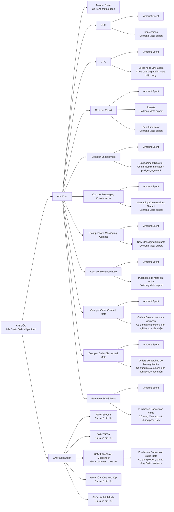

# KPI Tree Joycat — Ads Cost / GMV all platform

> Phiên bản: 3.0  
> Cập nhật: 2026-08-22  
> Trạng thái: Bản KPI inventory để Duy kiểm tra  
> Phạm vi: Chỉ liệt kê KPI và dữ liệu đầu vào cần có; không ghi công thức và không phân tích nguyên nhân.

## 1. Tree này trả lời gì?

> Muốn đọc KPI gốc `Ads Cost / GMV all platform`, Joycat cần tìm những chỉ số Meta nào và GMV từ những kênh nào?

Đây không dùng khung Chiến lược → Chủ đề → Chiến thuật → KPI. Mỗi node là một KPI hoặc dữ liệu đầu vào của KPI đó.

Các dimension như Campaign, Ad set, Ad, tháng, TOFU/MOFU/BOFU và LAL sẽ dùng để bẻ số ở bước phân tích; chúng không là node của KPI Tree.

## 2. KPI Tree chính

## 3. Danh mục KPI và dữ liệu đầu vào

| KPI hoặc dữ liệu | Dữ liệu đầu vào cần có | Trạng thái trong nguồn Joycat hiện dùng | Lưu ý |
|---|---|---|---|
| Ads Cost | Amount Spent | Có | Khi tổng hợp chỉ dùng một cấp: Campaign hoặc Ad set hoặc Ad |
| CPM | Amount Spent, Impressions | Có | Hai input phải cùng kỳ/cùng cấp |
| CPC | Amount Spent, Clicks hoặc Link Clicks | Chưa có | Hai cột Clicks chưa có trong `preferred_candidate` |
| Cost per Result | Amount Spent, Results, Result indicator | Có điều kiện | Không so các Result indicator khác nhau |
| Cost per Engagement | Amount Spent, Engagement Results | Có điều kiện | Chỉ dùng khi indicator là `post_engagement` |
| Cost per Messaging Conversation | Amount Spent, Messaging Conversations Started | Có | Chỉ là cuộc hội thoại Meta ghi nhận |
| Cost per New Messaging Contact | Amount Spent, New Messaging Contacts | Có | Không chứng minh chất lượng liên hệ |
| Cost per Meta Purchase | Amount Spent, Purchases | Có | Purchase là event Meta ghi nhận, không phải toàn bộ đơn kinh doanh |
| Cost per Order Created Meta | Amount Spent, Orders Created | Có một phần | Định nghĩa/coverage event chưa xác nhận |
| Cost per Order Dispatched Meta | Amount Spent, Orders Dispatched | Có một phần | Định nghĩa, hoàn/hủy và coverage chưa xác nhận |
| Purchase ROAS Meta | Amount Spent, Purchases Conversion Value | Có | Chỉ là metric Meta; không thay GMV hoặc ROAS business |
| GMV Facebook / Messenger | Giá trị đơn thực tế từ Facebook/Messenger | Chưa có | Export có `Purchases conversion value`, nhưng đây là giá trị Meta attribution; chưa xác minh là GMV business của kênh Facebook/Messenger |
| GMV all platform | GMV Shopee, TikTok, Facebook/Messenger, cửa hàng, kênh khác | Chưa có | Chưa có hợp đồng phạm vi kênh, kỳ và hoàn/hủy |

## 4. Ranh giới bắt buộc

- Tree không ghi công thức. Công thức của từng KPI sẽ được dựng trong Metric Tree.
- Campaign, Ad set, Ad, thời gian, phễu và LAL là dimension để phân tích từng KPI; không phải KPI.
- Purchases, Orders Created, Orders Dispatched và Purchases Conversion Value là số liệu Meta ghi nhận theo attribution; không được gọi là GMV hay đơn kinh doanh đã xác minh.
- `GMV all platform` không được thay bằng Purchase Conversion Value hoặc Purchase ROAS Meta.
- KPI thiếu dữ liệu vẫn giữ trên Tree để thấy đúng khoảng trống cần bổ sung.

## 5. Kiểm định KPI Tree v3

| Kiểm tra | Kết quả |
|---|---|
| Nút gốc là Ads Cost / GMV all platform | Đạt |
| Nhánh Meta chỉ gồm KPI/dữ liệu đầu vào Meta cụ thể | Đạt |
| Không ghi công thức trong Mermaid | Đạt |
| Không đưa Campaign/Ad set/Ad/phễu/LAL vào node KPI | Đạt |
| CPC được giữ dù thiếu Clicks | Đạt |
| GMV từng kênh được giữ dù chưa có dữ liệu | Đạt |
| Meta value/event không bị gọi là GMV/đơn kinh doanh | Đạt |

## 6. To be updated

### GMV all platform

Trạng thái: **To be updated**  
Thiếu: GMV từng kênh, kỳ đo, quy tắc hoàn/hủy và danh sách kênh đầy đủ.  
Owner/nguồn xác nhận: Người phụ trách dữ liệu Joycat hoặc cậu Sinh.  
Ảnh hưởng: Chặn việc tính KPI gốc; không chặn việc hoàn thiện nhánh Meta.  
Câu hỏi tiếp theo: GMV all platform của KPI 1 gồm chính xác những kênh nào?

### Clicks cho CPC

Trạng thái: **To be updated**  
Thiếu: `Clicks (all)` hoặc `Link clicks` cùng kỳ và cùng cấp dữ liệu.  
Owner/nguồn xác nhận: Meta Ads export hoặc người chuẩn bị dataset.  
Ảnh hưởng: Chưa tính được CPC; không chặn các KPI chi phí khác.  
Câu hỏi tiếp theo: Có export Meta nào chứa Clicks hoặc Link Clicks không?
