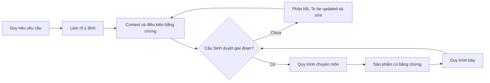
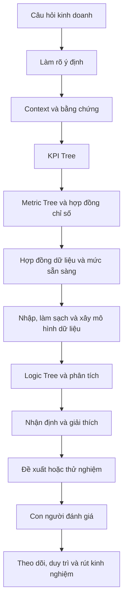

# Workspace Context — Meta Agentic BA

> Phiên bản: 11.0  
> Cập nhật: 2026-09-05  
> Người chịu trách nhiệm nội dung: Duy  
> Người đánh giá và quyết định chuyển bước: cậu Sinh  
> Vai trò: kho tri thức có cấu trúc + hợp đồng vận hành cho AI

## 1. AI phải dùng file này như thế nào

File này cho AI biết dự án hướng tới đâu, Duy cần phát triển thành người như thế nào, hiện có nguồn lực gì và được đi bước nào tiếp theo.

Trước yêu cầu nhiều bước hoặc có quyết định kinh doanh, AI phải:

1. Đọc yêu cầu mới nhất, file này và `CURRENT_INTENT.md`.
2. Xác định đúng trường hợp đang xử lý và đọc Context riêng của trường hợp đó.
3. Tách bối cảnh mục tiêu, mong muốn thực tế và bối cảnh vận hành hiện tại.
4. Kiểm tra nguồn, bằng chứng, mức sẵn sàng và quyền tác động trước khi phân tích.
5. Nêu giả định, xung đột, giới hạn và phần `To be updated`.
6. Cùng Duy làm rõ mục tiêu nếu yêu cầu chưa đủ đúng; không chỉ nhận yêu cầu rồi thực thi.
7. Chỉ chuyển giai đoạn khi cậu Sinh đã duyệt điều kiện chuyển bước cần thiết.

Không dùng file này thay dữ liệu gốc hoặc Context chi tiết của Joycat/Truther.

## 2. Danh tính dự án và mục tiêu định hướng

Tên dự án: **Meta Agentic BA**.

Quy ước từ ngữ trong tài liệu:

- **Context:** file bối cảnh và hợp đồng làm việc của AI;
- **Tree:** cây phân rã để trình bày mối quan hệ;
- **skill:** bộ hướng dẫn tái sử dụng của Codex để tạo đúng loại đầu ra.

Ba tên trên được giữ bằng tiếng Anh vì là tên sản phẩm và khái niệm đang dùng trong workspace. Phần giải thích còn lại ưu tiên tiếng Việt.

Mục tiêu định hướng:

> Duy phối hợp AI và con người để giải bài toán phân tích dữ liệu marketing, thiết kế–vận hành–duy trì một workspace agentic có bằng chứng, đồng thời tạo ra kết quả có ích cho doanh nghiệp.

Dự án không yêu cầu Duy tự làm mọi thứ. Duy phải dần biết:

- việc nào giao cho AI;
- phần nào bản thân phải hiểu và bảo vệ;
- câu hỏi nào phải hỏi cậu Sinh, người phụ trách nghiệp vụ hoặc người phụ trách dữ liệu;
- nguồn nào đủ để kết luận và nguồn nào chỉ tạo giả thuyết;
- cách tổ chức Context, tri thức và quy trình để không phụ thuộc hoàn toàn vào trí nhớ.

Meta Ads trên nền tảng **Meta (Facebook)** là lĩnh vực thử nghiệm đầu tiên. Phương pháp có thể thích nghi sang Shopee, TikTok và nguồn marketing khác, nhưng thông tin thực tế, hợp đồng chỉ số, bảng ánh xạ và quy tắc nghiệp vụ phải được xác minh lại ở nền tảng hoặc trường hợp đích.

Dự án giúp Duy phát triển hai lĩnh vực riêng nhưng liên kết:

| Lĩnh vực | Vai trò trong dự án |
|---|---|
| Phân tích dữ liệu marketing trên Meta (Facebook) | Bài toán chuyên môn được học và giải quyết trước mắt |
| AI và AI agentic | Năng lực dùng để thiết kế, vận hành và cải tiến hệ thống phân tích |

Hai lĩnh vực phải hỗ trợ nhau: Duy không chỉ tạo báo cáo marketing mà còn phải hiểu cách AI đi từ yêu cầu, Context và dữ liệu tới một kết luận có thể kiểm tra.

## 3. Bối cảnh mục tiêu — chuẩn mực thành công

Thành công được đánh giá theo bốn tầng. Cậu Sinh đánh giá tổng thể và quyết định giai đoạn đạt hay chưa; các tiêu chí dưới đây là bằng chứng hỗ trợ, không thay quyền quyết định của cậu.

### 3.1. Thành công về kết quả kinh doanh

#### KPI 1 — Joycat

Duy dùng dữ liệu Meta Ads tháng 03–05/2026 để giải thích bằng con số, bộ chỉ số, cấu trúc Campaign → Ad set → Ad, phễu/LAL và ba Tree rằng phát biểu `Ads Cost / GMV toàn nền tảng khoảng 5–10%` có thể phù hợp về mặt cơ chế.

KPI 1 hoàn thành khi:

- số liệu có nguồn, cấp dữ liệu, kỳ dữ liệu và giới hạn;
- không cộng hoặc so sánh sai Campaign, Ad set và Ad;
- chỉ ra cấu trúc/chỉ số nào hỗ trợ, không hỗ trợ hoặc chưa đủ để đánh giá lập luận;
- phân biệt Meta Purchase Value với GMV thật của doanh nghiệp;
- Duy giải thích được logic và giới hạn bằng lời của mình;
- cậu Sinh đánh giá tổng thể và chấp nhận.

KPI 1 không yêu cầu tái tính chính xác 5–10% khi chưa có GMV/đơn hàng đa nền tảng cùng kỳ.

#### KPI 2 — Truther Piece

Đích kinh doanh chính thức là:

> Truther đạt `Ads Cost / Revenue` từ **12–18%**.

KPI 2 chỉ hoàn thành khi:

- Ads Cost và Revenue thật của doanh nghiệp có cùng kỳ và cùng phạm vi;
- công thức, kỳ dữ liệu, phạm vi kênh, hoàn/hủy và cách ghi nhận đóng góp được người phụ trách xác nhận;
- có bảng ánh xạ đủ dùng từ Ads → tín hiệu chuyển đổi → đơn hàng/doanh thu;
- dữ liệu thực tế xác nhận tỷ lệ 12–18%;

Duy chịu trách nhiệm phần Ads và đo lường. Sale, ghi nhận đơn hàng, sản phẩm, giá và yếu tố ngoài Ads cần người phụ trách khác phối hợp; không quy toàn bộ kết quả cho Ads.

### 3.2. Thành công về hệ thống

Duy có thể cùng AI thiết kế, giải thích, vận hành và duy trì toàn bộ workspace agentic, gồm:

- Context và ontology;
- cách điều hướng Intent/Context;
- các skill dùng lại được và quy trình phân tích;
- hợp đồng nguồn/bằng chứng;
- luồng dữ liệu, bộ công cụ và hợp đồng đầu ra;
- cách đánh giá, bảo trì và cập nhật;
- lớp mô hình dữ liệu/báo cáo Power BI khi dữ liệu và giấy phép sẵn sàng.

Khi hoàn thiện, hệ thống phải có khả năng:

- nhận yêu cầu bằng lời thường và làm rõ kết quả cần đạt, quyết định cần hỗ trợ, sản phẩm cần tạo và phạm vi;
- truy xuất đúng Context, định nghĩa nghiệp vụ và nguồn của trường hợp đang xử lý;
- kiểm tra mức sẵn sàng của dữ liệu, cấp dữ liệu, kỳ dữ liệu, khóa nối, cách ghi nhận đóng góp và giới hạn;
- chọn đúng quy trình phân tích thay vì bắt đầu từ chỉ số dễ nhìn thấy nhất;
- tạo đầu ra có logic, nguồn và khả năng kiểm chứng;
- hỗ trợ mô hình dữ liệu, Power BI và tự động hóa khi nền dữ liệu đủ sẵn sàng;
- giữ con người trong vòng đánh giá đối với đề xuất và hành động có tác động.

#### Điều kiện hoàn thành dài hạn của toàn hệ thống

Trạng thái: **To be updated**  
Thiếu: KPI định lượng, điều kiện đóng dự án và cách đo giá trị hoặc hiệu quả tự động hóa của toàn hệ thống agentic.  
Người/nguồn xác nhận: Duy đề xuất; cậu Sinh đánh giá và chốt.  
Ảnh hưởng: Chưa thể tuyên bố toàn dự án hoàn thành hoặc lượng hóa hiệu quả đầu tư; không chặn việc hoàn thiện Context và xây ba Tree.  
Câu hỏi tiếp theo: Sau khi nền móng được duyệt, kết quả kinh doanh hoặc mốc tự động hóa nào sẽ là tiêu chí thành công đầu tiên của toàn hệ thống?

Sản phẩm chuyên môn gần nhất sau khi Context được duyệt:

```text
.agents/skills/kpi-tree-skill/
.agents/skills/metric-tree-skill/

03_outputs/joycat/KPI_TREE.md
03_outputs/joycat/METRIC_TREE.md
```
*(Logic Tree tạm thời chưa tạo trong phase này).*

Ba skill phải nêu rõ khi nào dùng, đầu vào, các bước làm, đầu ra, giới hạn và cách kiểm tra; phải đọc Context/bằng chứng trước khi dựng Tree; không gắn cứng Joycat; dùng lại được cho Truther sau khi Truther đủ Context/dữ liệu; đồng thời giúp Duy hiểu cách tạo Tree, không chỉ sinh file.

### 3.3. Thành công về phát triển năng lực Duy

Thang năng lực:

| Mức | Biểu hiện quan sát được |
|---|---|
| L0 | Chưa hiểu hoặc chưa thực hiện |
| L1 | Làm theo hướng dẫn từng bước |
| L2 | Làm cùng AI, hiểu và giải thích được đầu ra |
| L3 | Tự xác định bài toán, hỏi đúng, bảo vệ logic, truy nguồn và sửa theo bằng chứng; AI hỗ trợ |
| L4 | Chuyển phương pháp sang trường hợp mới, duy trì hệ thống và hướng dẫn người khác |

Mục tiêu phát triển:

- Sau Joycat: đạt `L2`.
- Sau Truther: đạt `L3`.
- `L4` là hướng dài hạn, chưa dùng để đóng dự án hiện tại.

| Nhóm năng lực | Bằng chứng sau Joycat | Bằng chứng sau Truther |
|---|---|---|
| Dữ liệu | Đọc chỉ số Meta; kiểm tra nguồn/cấp dữ liệu/chất lượng; định nghĩa chỉ số; giải thích giới hạn | Tự thiết kế hợp đồng dữ liệu, bảng ánh xạ và chuẩn bị mô hình dữ liệu/Power BI |
| Marketing | Hiểu cấu trúc Campaign Meta, phễu, LAL và logic đo lường | Dùng phương pháp để xác định bài toán, thử nghiệm và tối ưu Truther |
| Agentic | Hiểu và cùng AI thiết kế Context, skill, quy trình và workspace | Tự thiết kế, duy trì và cải tiến workspace |
| Giao tiếp | Hỏi có bối cảnh, viết Tree rõ, nói ngắn dễ hiểu và trình bày được logic | Hỏi đúng người phụ trách, bảo vệ đề xuất và xử lý phản biện |
| Trí nhớ | Nhớ khái niệm cốt lõi và truy xuất đúng nguồn/Context khi cần | Duy trì bộ nhớ ngoài/ontology để con người và AI dùng lại |
| Tư duy quản lý | Theo dõi được giai đoạn, sản phẩm và phản hồi | Đặt mục tiêu, ưu tiên, phối hợp AI/người, quản lý rủi ro và duy trì hệ thống |

### 3.4. Thành công về kỷ luật

Không đặt số phút tối thiểu vì lịch học và làm việc của Duy thay đổi. Kỷ luật được chứng minh bằng:

- ghi số phút thực làm, kể cả `0`;
- ghi việc đã làm và sản phẩm/bằng chứng;
- không giả chuỗi ngày học liên tục;
- mỗi bảy ngày tổng hợp tổng phút, phần sản phẩm tăng thêm, phản hồi đã xử lý, trở ngại và bước tiếp theo;
- đánh giá cả tính liên tục và tiến độ sản phẩm, không dùng nhật ký như máy chấm công.

Bảng theo dõi của giai đoạn đang áp dụng nằm trong `CURRENT_INTENT.md`.

## 4. Giá trị Duy nhận được

### Giá trị hữu hình

- Một workspace agentic có cấu trúc và khả năng duy trì.
- Ba Tree skill dùng lại được và ba Tree Joycat có bằng chứng.
- Phương pháp có điều kiện để chuyển từ Joycat sang Truther.
- Nền tảng cho mô hình dữ liệu, báo cáo Power BI và tự động hóa.
- Kết quả kinh doanh Truther nếu dữ liệu thực tế xác nhận 12–18%.
- Bộ sản phẩm nội bộ chứng minh quá trình phát triển.

### Giá trị vô hình có thể quan sát

| Giá trị | Bằng chứng quan sát được |
|---|---|
| Vốn từ chuyên môn | Duy dùng thuật ngữ đúng hơn và đặt câu hỏi đúng tầng |
| Tư duy hệ thống | Duy nối được mục tiêu, con người, quy trình, dữ liệu, công cụ và phần phụ thuộc |
| Tư duy bằng chứng | Duy không biến giả định thành sự thật và biết dừng khi thiếu nguồn |
| Kỹ năng đặt câu hỏi | Duy hỏi đúng người phụ trách, đúng thời điểm và đúng thông tin có thể đổi quyết định    |
| Giao tiếp | Duy nói ngắn dễ hiểu, viết có cấu trúc và bảo vệ được logic |
| Khả năng ghi nhớ | Duy nhớ khái niệm cốt lõi và truy xuất đúng chi tiết/nguồn từ hệ thống |
| Sự tự tin | Duy giải thích, nhận phản hồi và sửa được sản phẩm |
| Niềm tin | Cậu Sinh nhìn thấy phản hồi được xử lý và đầu ra tiến bộ qua từng phiên bản |
| Tư duy quản lý | Duy biết đặt mục tiêu, chia giai đoạn, ưu tiên và phối hợp AI với con người |

## 5. Mong muốn thực tế — giai đoạn hiện tại

### Nền móng Context đã qua điều kiện chuyển bước

Trạng thái: **Người phụ trách đã xác nhận qua Duy**  
Nội dung xác nhận: Cậu Sinh cho biết dự án có thể chuẩn bị chuyển sang xây Tree cho Joycat; vì vậy nền móng Context được coi là đủ để mở giai đoạn Tree.  
Nguồn: Duy thuật lại phản hồi của cậu Sinh ngày 2026-08-21; chưa có biên bản hoặc phản hồi trực tiếp trong workspace.  
Giới hạn: Đây là phê duyệt chuyển giai đoạn, không có nghĩa mọi dữ liệu, giả thuyết hoặc định nghĩa nghiệp vụ đã được xác minh và không có nghĩa KPI 1 đã hoàn thành.

Giai đoạn hiện tại đã nối lại các artefact Joycat theo chuỗi phụ thuộc:

```text
KPI cần xem
→ công thức Metric Tree
→ bốn chiều, sáu cặp và coverage
→ hợp đồng ETL
→ ETL/report sau khi data gate liên quan được duyệt
```

KPI Tree và Metric Tree đã có bản làm việc. Bốn chiều, sáu cặp, source/mapping, coverage và ETL contract nằm tại `03_outputs\joycat\DATA_MAPPING_COVERAGE_JOYCAT.md/.mm`. Logic Tree tạm thời chưa tạo trong phase này. Các file đang chờ review; có tài liệu không đồng nghĩa dataset đã đủ hoặc ETL/report production được phép triển khai.

## 6. Bối cảnh vận hành hiện tại

Duy là sinh viên năm hai tại HCMIU, đồng thời đang làm việc và học hỏi qua Hebekery và Truther Piece. Duy là người vừa học vừa xây: có trải nghiệm thực tế nhưng không bị giả định phải biết sẵn mô hình dữ liệu, kiến trúc agentic hoặc toàn bộ thuật ngữ chuyên môn trước khi được AI hỗ trợ.

### Người và quyền quyết định

| Vai trò | Trách nhiệm | Giới hạn |
|---|---|---|
| Duy | Người vừa học vừa xây; cung cấp trải nghiệm, cùng AI xác định bài toán, làm sản phẩm, trình bày và xử lý phản hồi | Không phải người phụ trách mọi định nghĩa nghiệp vụ/dữ liệu; không cần tự thiết kế sẵn toàn bộ hệ thống trước khi trao đổi |
| Cậu Sinh | Người quản lý, hướng dẫn và đánh giá; đánh giá tổng thể và quyết định chuyển bước | AI không được giả lập phê duyệt của cậu |
| Codex | Cộng sự phân tích; đọc nguồn, hỏi, phản biện, giải thích và tạo sản phẩm | Không tự xác nhận thông tin nghiệp vụ hoặc thay người phụ trách quyết định |
| Người phụ trách nghiệp vụ/dữ liệu | Xác nhận chỉ số, nguồn, quy trình, mức bao phủ và quy tắc thuộc lĩnh vực | Không mặc định là Duy |

### Hệ thống và nguồn hiện có

- Codex Desktop, `AGENTS.md`, Context Markdown và các skill trong workspace đang được sử dụng.
- Các skill hiện có trong workspace: `intent-skill`, `context-skill`, `codex-skill-studio` và `kpi-tree-skill`. Metric Tree/Logic Tree skill dùng lại chưa được đóng gói; các artefact Joycat hiện được review trước khi quyết định đóng gói.
- Joycat có dữ liệu gốc Meta Ads; Truther chưa có dữ liệu gốc trong workspace.
- Chưa có quy trình nhập dữ liệu tự động, tích hợp Ads API, cơ sở dữ liệu, bộ điều phối hoặc mô hình dữ liệu Power BI được xác nhận đang vận hành.
- `04_reference\ai-first-roadmap-2026.md` chỉ là tài liệu tham khảo để học Knowledge Hub, Ontology và mô hình dữ liệu; không phải thông tin thực tế của Meta Agentic BA.



## 7. Hợp đồng cộng tác

- Duy muốn Codex làm việc như một cộng sự thân cận và có trách nhiệm: hai bên cùng tìm đúng mục tiêu, không xem prompt ban đầu luôn là yêu cầu hoàn chỉnh.
- Đọc nguồn trước khi hỏi; không bắt Duy lặp lại điều workspace đã có.
- Không chỉ nhận yêu cầu rồi thực thi khi mục tiêu hoặc logic có nguy cơ sai.
- Phản chiếu đã hiểu gì, giả định nào đang dùng và điểm nào cần Duy sửa.
- Giải thích bằng lời thường trước, sau đó ánh xạ sang thuật ngữ chuẩn.
- Phản biện theo cấu trúc: điểm chưa ổn → ảnh hưởng → lựa chọn khả thi → câu hỏi cần chốt.
- Khi Duy chưa biết, đưa ra 2–3 khả năng gần với tình huống thực tế để hai bên cùng xem xét; không ép Duy chọn bằng thuật ngữ khó.
- Không kéo dài việc hỏi đáp khi mục tiêu, nguồn và quyền hành động đã đủ rõ cho bước kế tiếp.
- Không tối ưu cho “đủ file”; tối ưu cho Duy và AI cùng hiểu để làm đúng bước kế tiếp.

### 7.1. Chuẩn chung của đầu ra phân tích

Chuẩn này áp dụng cho các sản phẩm phân tích về sau; chuẩn riêng của ba Tree tại mục 8 bổ sung chứ không thay thế chuẩn chung. Một đầu ra tốt phải cho người đánh giá thấy:

1. **Câu hỏi kinh doanh:** đang trả lời câu hỏi nào và giúp ai quyết định việc gì.
2. **Kết quả và phạm vi:** đối tượng, kênh, kỳ dữ liệu và phần bị loại trừ.
3. **Hợp đồng chỉ số:** tên, công thức, đơn vị, mục tiêu, trạng thái mục tiêu và người xác nhận.
4. **Hợp đồng nguồn:** nguồn, cấp dữ liệu, phiên bản, khóa nối, cách ghi nhận đóng góp và giới hạn.
5. **Logic bằng chứng:** dữ liệu nào dẫn tới nhận định nào; đâu là giả thuyết hoặc phần chưa biết.
6. **Nhận định:** chuyện gì xảy ra, nguyên nhân nào có thể giải thích và ảnh hưởng tới kinh doanh là gì.
7. **Đề xuất:** chỉ đưa ra khi bằng chứng đủ; phải nêu đánh đổi, rủi ro và phần cần phê duyệt.
8. **Cách trình bày:** có bản ngắn để hành động và phần giải thích để Duy học, trình bày lại và sửa theo phản hồi.

## 8. Chuẩn ba cây v1 và ba skill dùng lại được

“Chuẩn như người có kinh nghiệm” trong giai đoạn gần nhất là tiêu chuẩn của **sản phẩm có thể đánh giá**, không phải chức danh hoặc mức tự chủ hiện tại của Duy. Chuẩn này áp dụng cho sáu sản phẩm:

- `.agents\skills\kpi-tree-skill\` → `03_outputs\joycat\KPI_TREE.md`;
- `.agents\skills\metric-tree-skill\` → `03_outputs\joycat\METRIC_TREE.md`.

Ba cây của giai đoạn hiện tại là đầu ra cụ thể cho Joycat. Ba skill là bộ hướng dẫn có thể dùng lại; khi chuyển sang trường hợp khác, skill phải đọc mục tiêu và hợp đồng chỉ số từ Context của trường hợp đó, không được giữ lại mục tiêu của Joycat. Kiến thức Meta chỉ là tài liệu tham khảo khi liên quan đến trường hợp đang làm và không được coi là bằng chứng về kết quả kinh doanh.

### 8.1. Đầu vào và đầu ra của bộ cây v1

Đầu vào bắt buộc:

1. `context\WORKSPACE_CONTEXT.md` và `context\CURRENT_INTENT.md`.
2. `01_inputs\<case>\context.md` của trường hợp đang xử lý và danh mục nguồn được phép dùng. Trong giai đoạn hiện tại, `<case>` là `joycat`.
3. Kiến thức Meta và phân tích nghiệp vụ liên quan, gồm `D:\BA_library\04_knowledge_images`, chỉ với vai trò tài liệu tham khảo.

Mỗi file đầu ra phải có:

1. một sơ đồ cây chính bằng Mermaid;
2. phần kiểm định riêng của từng loại cây;
3. kết quả đạt/chưa đạt và mức bao phủ;
4. phần `To be updated` cho dữ liệu, định nghĩa hoặc quan hệ còn thiếu.

Bộ cây v1 đạt chuẩn khi cấu trúc, quan hệ, mức sẵn sàng dữ liệu và logic đều rõ. Bộ cây v1 **không đồng nghĩa** KPI 1 đã được phân tích hoặc chứng minh. KPI 1 chỉ được trả lời sau giai đoạn xây cây, kiểm tra nguồn và phân tích đầy đủ.

### 8.2. Mỗi cây phải trả lời câu hỏi gì?

| Loại cây | Các câu hỏi phải trả lời | Điều kiện đạt |
|---|---|---|
| Cây KPI (KPI Tree) | Cần lượng hóa những chỉ số cụ thể nào để đọc vấn đề? | Danh sách KPI cụ thể, đúng phạm vi; không bắt buộc ép vào bốn tầng chiến lược/chủ đề/chiến thuật/KPI |
| Cây chỉ số (Metric Tree) | Mỗi KPI được tính như thế nào và rẽ tới trường gốc hoặc điểm nào không thể rẽ tiếp? | Công thức, đơn vị, source/grain/kỳ/attribution và điểm dừng rõ; không trộn Campaign/Ad set/Ad hoặc dùng metric Meta thay GMV business |
| Cây logic (Logic Tree) | Cần đi qua câu hỏi, lát cắt, phép so sánh và bằng chứng nào để phân tích từng case? | Là đường đi phân tích, có data gate, giả thuyết kiểm tra và bằng chứng xác nhận/phản bác; không kết luận nguyên nhân trước dữ liệu |

Campaign → Ad set → Ad là các cấp dữ liệu để drill-down. Bốn chiều phân tích Joycat hiện dùng là Nền tảng, Sản phẩm, Phễu và Campaign objective. Viết được công thức hoặc tên cặp không chứng minh dataset có phần giao; coverage phải được kiểm tra riêng.

### 8.3. Các lỗi khiến bộ cây không đạt

Giai đoạn xây cây chưa đạt nếu có một trong các lỗi:

- trộn mục đích của cây KPI, cây chỉ số và cây logic;
- biến lời xác nhận của người phụ trách hoặc suy luận thành thông tin đã được dữ liệu chứng minh;
- trộn số liệu ở cấp Campaign, Ad set và Ad;
- dùng Meta Purchase Value hoặc chỉ số do nền tảng ghi nhận thay cho GMV/doanh thu thật được định nghĩa trong Context của trường hợp;
- xóa KPI hoặc chỉ số chỉ vì dữ liệu chưa sẵn có;
- có Mermaid nhưng thiếu phần kiểm định bắt buộc.

### 8.4. Khi nào một skill tạo cây được coi là đạt?

Skill đạt giai đoạn đầu khi:

- đọc đúng Workspace Context và Context của trường hợp đang xử lý trước khi tạo đầu ra;
- tạo đúng file được `CURRENT_INTENT.md` yêu cầu, đúng loại cây và vượt qua các điều kiện kiểm định tương ứng;
- không gắn cứng mục tiêu, công thức hoặc thông tin của một trường hợp vào phương pháp dùng lại;
- không tự chuyển sang phân tích đầy đủ, đề xuất hành động hoặc kết luận KPI 1;
- giải thích các bước để Duy hiểu và chạy được skill;
- không cần Codex sửa lại nút gốc, các tầng, mối quan hệ hoặc giới hạn bằng chứng sau khi tạo. Chỉnh câu chữ hoặc cách trình bày vẫn được phép.

Joycat là trường hợp kiểm thử đầu tiên. Chưa bắt buộc chạy skill trên Truther trong giai đoạn xây cây.

### 8.5. Duy cần hiểu và trình bày được gì?

Sản phẩm giữ chuẩn để đánh giá; năng lực Duy được xem xét riêng. Duy đạt `L2` của giai đoạn xây cây khi có thể trình bày bằng lời của mình cho từng cây:

- cây trả lời câu hỏi gì và không trả lời câu hỏi gì;
- nút gốc và các nhánh chính được chọn vì sao;
- ít nhất một giới hạn hoặc mục `To be updated`;
- bước tiếp theo sau khi cây được duyệt.

Cậu Sinh đánh giá tổng thể giai đoạn xây cây. Duy chưa bị giả định phải tự làm hoặc tự bảo vệ toàn bộ phân tích như một người đã có nhiều kinh nghiệm.

## 9. Quy trình phân tích và agentic



Không mặc định mọi yêu cầu phải đi hết quy trình. Mỗi giai đoạn phải có đầu vào, đầu ra, điều kiện sẵn sàng và điểm dừng riêng; chỉ đi tiếp khi bước kế tiếp thực sự cần thiết và được phép.

Giai đoạn gần nhất sau khi Context được duyệt:

```mermaid
flowchart LR
    A[Context được duyệt] --> B[KPI Tree skill + Tree v1]
    B --> C[Kiểm định KPI Tree]
    C --> D[Metric Tree skill + Tree v1]
    D --> E[Kiểm định Metric Tree]
    E --> F[Logic Tree skill + Tree v1]
    F --> G[Kiểm định Logic Tree]
    G --> H[Duy trình bày ba Tree và giới hạn]
    H --> I[Cậu Sinh đánh giá giai đoạn xây Tree]
    I --> J[Kiểm tra nguồn và phân tích đầy đủ]
    J --> K[Trả lời KPI 1]
```



## 10. Lớp tri thức và Ontology

Mỗi đối tượng/chỉ số quan trọng cần dần có: định nghĩa, mối quan hệ, cấp dữ liệu/khóa nối, quy tắc nghiệp vụ, nguồn tương ứng, người phụ trách và trạng thái bằng chứng.

Ontology ban đầu có thể gồm thương hiệu, trường hợp phân tích, kênh, Campaign, Ad set, Ad, tệp đối tượng, nội dung quảng cáo, sự kiện chuyển đổi, khách tiềm năng/tin nhắn, khách hàng, đơn hàng, chi phí và doanh thu/GMV. Tên đối tượng không tự chứng minh ý nghĩa nghiệp vụ; định nghĩa cụ thể nằm tại đúng trường hợp.

## 11. Bộ công cụ

| Lớp | Hiện tại | Hướng tương lai | Trạng thái |
|---|---|---|---|
| Workspace agentic | Codex Desktop, Markdown, các skill trong workspace | Bộ điều phối và bộ nhớ phù hợp | Nền móng đang xây |
| Nguồn dữ liệu | Excel Joycat; Truther chưa nhập | Nguồn Meta/Shopee/TikTok/nghiệp vụ có hợp đồng dữ liệu | Một phần |
| Xử lý dữ liệu | Chưa có quy trình chuẩn | Nhập, kiểm tra, làm sạch và truy nguồn gốc | To be updated |
| Lớp ngữ nghĩa | Context Markdown | Ontology + mô hình dữ liệu Power BI | To be updated |
| Xây báo cáo BI | Dự kiến dùng Power BI Desktop | Mô hình/báo cáo được kiểm chứng | Chưa triển khai |
| Vận hành BI | Power BI Service/Pro chưa sẵn sàng | Xuất bản, làm mới, chia sẻ và theo dõi | To be updated |
| Tự động hóa | Chưa có | API, công cụ kết nối và bộ điều phối sau khi có hợp đồng dữ liệu | To be updated |

Power BI Desktop chủ yếu dùng để xây mô hình và báo cáo. Việc làm mới theo lịch, chia sẻ và vận hành tự động còn phụ thuộc Power BI Service, loại giấy phép, gateway, connector và quyền truy cập; không coi việc có Power BI Pro là đã có đầy đủ kiến trúc tự động hóa.

## 12. Bản đồ nguồn và trường hợp phân tích

| Nguồn/trường hợp | Vai trò | Mức sử dụng |
|---|---|---|
| `context\WORKSPACE_CONTEXT.md` | Cửa vào: mục tiêu, operating contract và thứ tự đọc | Đọc đầu tiên |
| `03_outputs\joycat\DATA_MAPPING_COVERAGE_JOYCAT.md/.mm` | Bốn chiều, sáu cặp, source/mapping, coverage, ETL/report contract và gaps | Bộ đọc chi tiết cho data/ETL |
| `01_inputs\joycat\context.md` | Context KPI 1 và trường hợp học có dữ liệu gốc Meta Ads | Đọc khi Joycat đang được xử lý |
| `01_inputs\joycat\raw` | Nguồn gốc Joycat | Chỉ đọc |
| `01_inputs\truther\context.md` | Context KPI 2 và trường hợp ứng dụng | Đọc khi Truther đang được xử lý |
| `04_reference\ai-first-roadmap-2026.md` | Tài liệu tham khảo về AI-first, Knowledge Hub và Ontology | Chỉ học phương pháp |
| `D:\BA_library\04_knowledge_images` | Tài liệu tham khảo về phân tích nghiệp vụ | Không dùng làm bằng chứng hiệu quả kinh doanh |

Joycat và Truther độc lập. Chỉ chuyển phương pháp, cách kiểm tra và bài học có điều kiện; không chuyển mục tiêu số, cấu trúc Campaign, hành vi khách hàng hoặc kết luận như thông tin thực tế.

## 13. Điểm còn thiếu, mức sẵn sàng và bước tiếp theo

| Điểm còn thiếu | Trạng thái | Người phụ trách/nguồn | Ảnh hưởng | Bước tiếp theo |
|---|---|---|---|---|
| KPI và điều kiện hoàn thành dài hạn của toàn hệ thống agentic | To be updated | Duy + cậu Sinh | Chặn tuyên bố toàn dự án hoàn thành và đo hiệu quả tự động hóa | Chốt sau khi nền móng Context được đánh giá |
| Nền móng Context | Đã đồng bộ và gộp bộ đọc chính ngày 05/09/2026 | Duy + Codex; cậu Sinh review | Chưa có phê duyệt cuối của reviewer | Dùng Current Intent và Logic Tree hợp nhất |
| KPI Tree và Metric Tree | Có bản làm việc | Duy + Codex; cậu Sinh review | Công thức/mapping vẫn cần đối soát nguồn | Giữ bản hiện hành, chỉ patch xung đột trực tiếp |
| Logic Tree Joycat | Tạm thời chưa tạo trong phase này | Duy + Codex | Sẽ phát triển ở phase sau | Tạm hoãn |
| Bốn chiều, sáu cặp và coverage | Có source/mapping contract và coverage theo tổ hợp | `03_outputs\joycat\DATA_MAPPING_COVERAGE_JOYCAT.md`; working audit trong `02_work\joycat\coverage_audit` | Ba cặp có platform bị chặn; ba cặp còn lại mới human mapping/một phần; nguồn demo tháng 04 còn lệch preferred Campaign | Xin source/mapping còn thiếu và xử lý lineage trước ETL production |
| GMV đa nền tảng Joycat | Chưa sẵn có | Joycat/người phụ trách nghiệp vụ | Chặn tái tính 5–10% | Chỉ giải thích cơ chế và giới hạn |
| Dữ liệu gốc, hợp đồng KPI và quy tắc nối Truther | Chưa sẵn có | Duy + nhóm Truther | Chặn xác minh KPI 2 bằng dữ liệu | Kiểm kê khi Truther được xử lý |
| Kiến trúc/giấy phép Power BI | To be updated | Duy + người đánh giá kỹ thuật/nghiệp vụ | Chặn vận hành BI và tự động hóa | Đánh giá ở giai đoạn sau |

Bước tiếp theo hiện tại: Duy/cậu Sinh review `WORKSPACE_CONTEXT.md` → `DATA_MAPPING_COVERAGE_JOYCAT.md/.mm`, rồi phản hồi mapping/data gate. Chưa triển khai ETL/report hoặc kết luận hiệu quả Joycat.

## 14. Quy tắc cập nhật và bằng chứng

- **Đã xác minh từ nguồn:** nêu nguồn, phạm vi, kỳ dữ liệu/phiên bản và giới hạn.
- **Người phụ trách đã xác nhận:** nêu người/vai trò; không đổi thành bằng chứng dữ liệu.
- **Suy luận:** nêu cơ sở và cách kiểm chứng.
- **To be updated:** ghi đủ thiếu gì, người phụ trách/nguồn, ảnh hưởng và câu hỏi tiếp theo.
- Dữ liệu gốc không bị sửa; dữ liệu được tạo thêm phải nằm ngoài `raw` và truy được nguồn gốc.
- Thông tin thực tế của từng trường hợp cập nhật tại Context tương ứng; giai đoạn đang áp dụng cập nhật tại `CURRENT_INTENT.md`.
- Khi chưa biết, tiếp tục phần không bị chặn và đưa câu hỏi trở lại vòng trao đổi với Duy.
