# Metric Tree Joycat — rẽ tới dữ liệu gốc

> Phiên bản: 3.1  
> Cập nhật: 2026-09-05  
> Trạng thái: Bản Metric Tree để Duy kiểm tra  
> Phạm vi: Viết công thức cho các KPI trong `KPI_TREE.md`; định nghĩa bốn chiều và coverage sáu cặp nằm tại `DATA_MAPPING_COVERAGE_JOYCAT.md`; đường đặt câu hỏi nằm tại `LOGIC_TREE.md`. Chưa phân tích nguyên nhân và chưa kết luận tỷ lệ 5–10%.

## 1. Metric Tree này trả lời gì?

> Mỗi KPI trong `KPI_TREE.md` được tính từ những đại lượng nào, các đại lượng đó lấy từ đâu và phải dừng phân rã tại điểm nào?

Metric Tree chỉ thể hiện quan hệ tính toán. Đường đi `Impression → Click → Mess → Purchase` không nằm trong Tree này vì đó là quan hệ quy trình, không phải đẳng thức toán học; phần đó thuộc Logic Tree.

## 2. Quy tắc rẽ và quy tắc dừng

Mỗi KPI được rẽ thành tử số, mẫu số, phép toán và điều kiện đo. Tiếp tục rẽ cho tới khi node lá thuộc một trong bốn loại:

| Nhãn node lá | Nghĩa | Cách xử lý |
|---|---|---|
| `[Meta export trực tiếp — DỪNG]` | Field đã có trực tiếp trong export Joycat | Không rẽ thành hành vi phễu; chỉ ghi định nghĩa, kỳ, cấp và attribution |
| `[Business source trực tiếp — DỪNG]` | Field lấy trực tiếp từ nguồn bán hàng/doanh nghiệp | Không thay bằng metric Meta |
| `[Hằng số — DỪNG]` | Số cố định trong công thức như `1.000` hoặc `100%` | Không rẽ tiếp |
| `[Chưa có dữ liệu — To be updated — DỪNG]` | Metric cần thiết nhưng workspace chưa có nguồn | Giữ node, ghi owner và ảnh hưởng; không tự ước lượng |

Các cột cost hoặc ROAS do Meta tính sẵn chỉ dùng để **đối soát**. Công thức chính luôn được tính lại từ tổng tử số và tổng mẫu số.

## 3. Metric Tree chính

```mermaid
flowchart LR
    ROOT["KPI GỐC<br/>Ads Cost / GMV all platform"]

    ROOT --> AC["ADS COST TRONG KỲ"]
    AC --> AC_SUM["SUM Amount Spent của Campaign"]
    AC_SUM --> AC_RAW["Amount spent VND<br/>Meta export trực tiếp — DỪNG"]

    ROOT --> GMV["GMV ALL PLATFORM CÙNG KỲ"]
    GMV --> G_SHOPEE["GMV Shopee<br/>Chưa có dữ liệu — DỪNG"]
    GMV --> G_TIKTOK["GMV TikTok<br/>Chưa có dữ liệu — DỪNG"]
    GMV --> G_FB["GMV Facebook hoặc Messenger<br/>Chưa có business data — DỪNG"]
    GMV --> G_STORE["GMV cửa hàng trực tiếp<br/>Chưa có dữ liệu — DỪNG"]
    GMV --> G_OTHER["GMV kênh khác<br/>Chưa có dữ liệu — DỪNG"]

    AC --> CPM["CPM"]
    CPM --> CPM_SPEND["SUM Amount Spent"]
    CPM_SPEND --> CPM_SPEND_RAW["Amount spent VND<br/>Meta export trực tiếp — DỪNG"]
    CPM --> CPM_IMP["SUM Impressions"]
    CPM_IMP --> CPM_IMP_RAW["Impressions<br/>Meta export trực tiếp — DỪNG"]
    CPM --> CPM_1000["1.000<br/>Hằng số — DỪNG"]

    AC --> CPC_LINK["CPC LINK"]
    CPC_LINK --> CPCL_SPEND["SUM Amount Spent"]
    CPCL_SPEND --> CPCL_SPEND_RAW["Amount spent VND<br/>Meta export trực tiếp — DỪNG"]
    CPC_LINK --> CPCL_CLICK["SUM Link Clicks"]
    CPCL_CLICK --> CPCL_CLICK_RAW["Link clicks<br/>Preferred candidate chưa có — DỪNG"]

    AC --> CPC_ALL["CPC ALL"]
    CPC_ALL --> CPCA_SPEND["SUM Amount Spent"]
    CPCA_SPEND --> CPCA_SPEND_RAW["Amount spent VND<br/>Meta export trực tiếp — DỪNG"]
    CPC_ALL --> CPCA_CLICK["SUM Clicks all"]
    CPCA_CLICK --> CPCA_CLICK_RAW["Clicks all<br/>Preferred candidate chưa có — DỪNG"]

    AC --> CPR_TYPES["COST PER RESULT THEO TỪNG LOẠI"]

    CPR_TYPES --> CPMC["MESSAGING RESULT"]
    CPMC --> CPMC_SPEND["SUM Amount Spent của dòng messaging"]
    CPMC_SPEND --> CPMC_SPEND_RAW["Amount spent VND<br/>Meta export trực tiếp — DỪNG"]
    CPMC --> CPMC_MESS["SUM Messaging Conversations Started"]
    CPMC_MESS --> CPMC_MESS_RAW["Messaging conversations started<br/>Meta export trực tiếp — DỪNG"]

    CPR_TYPES --> CPE["POST ENGAGEMENT RESULT"]
    CPE --> CPE_SPEND["SUM Amount Spent của dòng post engagement"]
    CPE_SPEND --> CPE_SPEND_RAW["Amount spent VND<br/>Meta export trực tiếp — DỪNG"]
    CPE --> CPE_RESULT["SUM Results với indicator post_engagement"]
    CPE_RESULT --> CPE_RESULT_RAW["Results<br/>Meta export trực tiếp — DỪNG"]

    CPR_TYPES --> CPP["PURCHASE RESULT"]
    CPP --> CPP_SPEND["SUM Amount Spent của dòng purchase"]
    CPP_SPEND --> CPP_SPEND_RAW["Amount spent VND<br/>Meta export trực tiếp — DỪNG"]
    CPP --> CPP_PURCHASE["SUM Purchases do Meta ghi nhận"]
    CPP_PURCHASE --> CPP_PURCHASE_RAW["Purchases<br/>Meta export trực tiếp — DỪNG"]

    CPR_TYPES --> CP_RECALL["ESTIMATED AD RECALL RESULT"]
    CP_RECALL --> CP_RECALL_SPEND["SUM Amount Spent của dòng ad recall"]
    CP_RECALL_SPEND --> CP_RECALL_SPEND_RAW["Amount spent VND<br/>Meta export trực tiếp — DỪNG"]
    CP_RECALL --> CP_RECALL_RESULTS["SUM Results với indicator estimated_ad_recallers"]
    CP_RECALL_RESULTS --> CP_RECALL_RESULTS_RAW["Results<br/>Meta export trực tiếp — DỪNG"]

    CPR_TYPES --> CPR_UNKNOWN["RESULT CHƯA XÁC ĐỊNH"]
    CPR_UNKNOWN --> CPR_SPEND["SUM Amount Spent trong cùng Result indicator"]
    CPR_SPEND --> CPR_SPEND_RAW["Amount spent VND<br/>Meta export trực tiếp — DỪNG"]
    CPR_UNKNOWN --> CPR_RESULT["SUM Results trong cùng Result indicator"]
    CPR_RESULT --> CPR_RESULT_RAW["Results<br/>Meta export trực tiếp — DỪNG"]

    AC --> CPNC["COST PER NEW MESSAGING CONTACT"]
    CPNC --> CPNC_SPEND["SUM Amount Spent"]
    CPNC_SPEND --> CPNC_SPEND_RAW["Amount spent VND<br/>Meta export trực tiếp — DỪNG"]
    CPNC --> CPNC_CONTACT["SUM New Messaging Contacts"]
    CPNC_CONTACT --> CPNC_CONTACT_RAW["New messaging contacts<br/>Meta export trực tiếp — DỪNG"]

    AC --> CPOC["COST PER ORDER CREATED META"]
    CPOC --> CPOC_SPEND["SUM Amount Spent"]
    CPOC_SPEND --> CPOC_SPEND_RAW["Amount spent VND<br/>Meta export trực tiếp — DỪNG"]
    CPOC --> CPOC_ORDER["SUM Orders Created"]
    CPOC_ORDER --> CPOC_ORDER_RAW["Orders created do Meta ghi nhận<br/>Meta export trực tiếp — DỪNG"]

    AC --> CPOD["COST PER ORDER DISPATCHED META"]
    CPOD --> CPOD_SPEND["SUM Amount Spent"]
    CPOD_SPEND --> CPOD_SPEND_RAW["Amount spent VND<br/>Meta export trực tiếp — DỪNG"]
    CPOD --> CPOD_ORDER["SUM Orders Dispatched"]
    CPOD_ORDER --> CPOD_ORDER_RAW["Orders dispatched do Meta ghi nhận<br/>Meta export trực tiếp — DỪNG"]

    AC --> ROAS["PURCHASE ROAS META"]
    ROAS --> ROAS_VALUE["SUM Purchases Conversion Value"]
    ROAS_VALUE --> ROAS_VALUE_RAW["Purchases conversion value<br/>Meta export trực tiếp — DỪNG"]
    ROAS --> ROAS_SPEND["SUM Amount Spent"]
    ROAS_SPEND --> ROAS_SPEND_RAW["Amount spent VND<br/>Meta export trực tiếp — DỪNG"]
```



### Cách map các lát cắt Ads Cost trong KPI v4

```text
Ads Cost theo một chiều
= SUM Amount Spent sau khi lọc theo Nền tảng hoặc Sản phẩm hoặc Phễu hoặc Objective

Ads Cost theo cặp 2
= SUM Amount Spent sau khi lọc đồng thời theo 2 điều kiện

Ads Cost theo cặp 3
= SUM Amount Spent sau khi lọc đồng thời theo 3 điều kiện
```

Ví dụ:

```text
AS Facebook (SP1)
= SUM Amount Spent khi Nền tảng = Facebook và Sản phẩm = SP1

AS Facebook (TOFU, SP1)
= SUM Amount Spent khi Nền tảng = Facebook, Phễu = TOFU và Sản phẩm = SP1
```

Nền tảng, Sản phẩm, Phễu và Objective là điều kiện lọc hoặc mapping; field tiền cuối cùng vẫn là `Amount spent (VND)`. Không cộng kết quả một chiều, cặp 2 và cặp 3 với nhau.

## 4. Công thức và điểm dừng của từng KPI

| KPI | Công thức tính lại | Node lá trực tiếp | Đơn vị | Trạng thái | Cột Meta dùng đối soát |
|---|---|---|---|---|---|
| Ads Cost / GMV all platform | `Ads Cost / GMV all platform × 100%` | Amount Spent; GMV từng kênh | VND/VND → % | Chưa sẵn có GMV | Không có |
| Ads Cost | `SUM Amount Spent` tại Campaign | `Amount spent (VND)` | VND | Sẵn có | Không cần |
| CPM | `SUM Amount Spent / SUM Impressions × 1.000` | `Amount spent (VND)`; `Impressions`; hằng số `1.000` | VND/1.000 impressions | Sẵn có | Không có trong preferred candidate hiện dùng |
| CPC link | `SUM Amount Spent / SUM Link Clicks` | `Amount spent (VND)`; `Link clicks` | VND/link click | Chưa sẵn có Clicks | Chưa có |
| CPC all | `SUM Amount Spent / SUM Clicks (all)` | `Amount spent (VND)`; `Clicks (all)` | VND/click | Chưa sẵn có Clicks | Chưa có |
| Cost per Messaging Result | `SUM Amount Spent của dòng messaging / SUM Messaging Conversations Started` | `Amount spent (VND)`; `Messaging conversations started`; `Result indicator` | VND/conversation | Sẵn có | `Cost per messaging conversation started (VND)` |
| Cost per Post Engagement Result | `SUM Amount Spent của dòng post engagement / SUM Results cùng indicator` | `Amount spent (VND)`; `Results`; `Result indicator` | VND/engagement | Sẵn có có điều kiện | `Cost per results` trong đúng nhóm indicator |
| Cost per Purchase Result | `SUM Amount Spent của dòng purchase / SUM Purchases do Meta ghi nhận` | `Amount spent (VND)`; `Purchases`; `Result indicator` | VND/Meta purchase | Sẵn có | `Cost per results` trong đúng nhóm indicator |
| Cost per Estimated Ad Recall Result | `SUM Amount Spent của dòng ad recall / SUM Results cùng indicator` | `Amount spent (VND)`; `Results`; `Result indicator` | VND/estimated ad recaller | Sẵn có có điều kiện | `Cost per results` trong đúng nhóm indicator |
| Cost per Result chưa xác định | `SUM Amount Spent / SUM Results` trong cùng `Result indicator` | `Amount spent (VND)`; `Results`; `Result indicator` | VND/result | Sẵn có có điều kiện | `Cost per results` trong đúng nhóm indicator |
| Cost per New Messaging Contact | `SUM Amount Spent / SUM New Messaging Contacts` | `Amount spent (VND)`; `New messaging contacts` | VND/contact | Sẵn có | `Cost per new messaging contact (VND)` |
| Cost per Order Created Meta | `SUM Amount Spent / SUM Orders Created` | `Amount spent (VND)`; `Orders created` | VND/Meta order event | Sẵn có một phần | Không có |
| Cost per Order Dispatched Meta | `SUM Amount Spent / SUM Orders Dispatched` | `Amount spent (VND)`; `Orders dispatched` | VND/Meta order event | Sẵn có một phần | Không có |
| Purchase ROAS Meta | `SUM Purchases Conversion Value / SUM Amount Spent` | `Purchases conversion value`; `Amount spent (VND)` | VND/VND → lần | Sẵn có | `Purchase ROAS (return on ad spend)` |
| GMV all platform | `GMV Shopee + TikTok + Facebook/Messenger + cửa hàng + kênh khác` | GMV từng kênh | VND | Chưa sẵn có | Không có |

## 5. Giải thích điểm dừng quan trọng

### Messaging Conversations Started

```text
Cost per Messaging Conversation
├── SUM Amount Spent
│   └── Amount spent (VND) [Meta export trực tiếp — DỪNG]
└── SUM Messaging Conversations Started
    └── Messaging conversations started [Meta export trực tiếp — DỪNG]
```

`Messaging conversations started` là số Meta Accounts bắt đầu cuộc hội thoại sau ít nhất 7 ngày không hoạt động, được Meta attribution cho quảng cáo. Workspace chỉ có con số Meta tổng hợp, không có event log bên dưới, nên không thể rẽ toán học sâu hơn.

Khi `Result indicator = actions:onsite_conversion.messaging_conversation_started_7d`, `Results` có thể khớp với `Messaging conversations started`. Khi indicator là `post_engagement` hoặc event khác, hai field không đại diện cùng một kết quả và không được thay thế cho nhau.

### Purchases, Orders Created và Orders Dispatched

Ba field này là event Meta xuất trực tiếp nên Metric Tree dừng tại đó. Không nối toán học:

```text
Purchases → Orders Created → Orders Dispatched
```

Trong raw có trường hợp `Orders Dispatched > Orders Created`, vì vậy ba field phải giữ độc lập cho tới khi owner tracking xác nhận định nghĩa và coverage.

### GMV từng kênh

Metric Tree dừng ở GMV Shopee, TikTok, Facebook/Messenger, cửa hàng và kênh khác vì chưa có nguồn cũng như quy tắc hoàn/hủy, voucher và thời điểm ghi nhận. Không tự rẽ thành `Số đơn × Giá trị đơn trung bình` khi định nghĩa tập đơn chưa được khóa.

## 6. Công thức kiểm tra chéo

Các công thức này dùng để kiểm tra quan hệ giữa metric, không tạo thêm nhánh chính để tránh vòng lặp:

```text
CTR link = Link Clicks / Impressions

Result rate = Results / Impressions

Tỷ lệ Link Click → Messaging Conversation
= Messaging Conversations Started / Link Clicks

Tỷ lệ New Contact trên Conversation
= New Messaging Contacts / Messaging Conversations Started

CPC link
= CPM / (1.000 × CTR link)

Cost per Result
= CPM / (1.000 × Result rate)

Cost per Messaging Conversation
= CPC link / Tỷ lệ Link Click → Messaging Conversation

Cost per New Messaging Contact
= Cost per Messaging Conversation / Tỷ lệ New Contact trên Conversation
```

Nếu tỷ lệ được hiển thị là phần trăm, phải đổi về số thập phân trước khi thay vào công thức: `2% = 0,02`.

Các công thức dùng Click chỉ kích hoạt sau khi có `Link clicks` hoặc `Clicks (all)` cùng kỳ, cấp và attribution.

## 7. Hợp đồng tổng hợp dữ liệu

### Không lấy trung bình metric tỷ lệ hoặc chi phí

```text
CPM tổng
= SUM Amount Spent / SUM Impressions × 1.000

CPR tổng
= SUM Amount Spent / SUM Results

Purchase ROAS tổng
= SUM Purchases Conversion Value / SUM Amount Spent
```

Không dùng `AVERAGE(CPM)`, `AVERAGE(CPR)` hoặc `AVERAGE(ROAS)` giữa các Campaign.

### Cấp dữ liệu

- Cấp tổng hợp chính: Campaign.
- Ad set và Ad chỉ dùng để đi sâu hoặc đối soát.
- Không cộng Amount Spent của Campaign + Ad set + Ad.
- Có thể dùng dòng tổng Meta hoặc tổng các dòng Campaign, nhưng không dùng đồng thời cả hai.

### Điều kiện so sánh

Mọi tử số và mẫu số phải cùng:

- kỳ báo cáo;
- cấp Campaign, Ad set hoặc Ad;
- attribution setting;
- phạm vi dòng;
- đơn vị tiền;
- Result indicator nếu công thức sử dụng `Results`.

## 8. Nguồn và trạng thái dữ liệu

Chín file `01_inputs/joycat/raw/meta_ads/preferred_candidate` có ba cấp Campaign, Ad set và Ad cho tháng 03–05/2026.

| Field cần dùng | Có trong preferred candidate? | Điểm dừng |
|---|---|---|
| Amount spent (VND) | Có | Meta export trực tiếp |
| Impressions | Có | Meta export trực tiếp |
| Results | Có | Meta export trực tiếp; phải đi cùng indicator |
| Result indicator | Có | Meta export trực tiếp; điều kiện đo |
| Purchases | Có | Meta export trực tiếp; event attribution |
| Purchases conversion value | Có | Meta export trực tiếp; không phải GMV |
| Purchase ROAS | Có | Cột đối soát |
| New messaging contacts | Có | Meta export trực tiếp |
| Messaging conversations started | Có | Meta export trực tiếp |
| Orders created | Có | Meta export trực tiếp; coverage chưa xác nhận |
| Orders dispatched | Có | Meta export trực tiếp; coverage chưa xác nhận |
| Clicks (all) | Không | To be updated |
| Link clicks | Không | To be updated |
| GMV từng kênh | Không | To be updated từ business source |

## 9. Kiểm định Metric Tree v3

| Kiểm tra | Kết quả |
|---|---|
| Các KPI cần tính trong KPI v4 có công thức và điểm dừng | Đạt |
| Mọi nhánh được rẽ tới field trực tiếp, hằng số hoặc điểm thiếu dữ liệu | Đạt |
| Messaging Conversations Started có nguồn và lý do dừng | Đạt |
| Không biến phễu Impression → Click → Mess → Purchase thành công thức | Đạt |
| Không lấy trung bình CPM, CPR hoặc ROAS theo dòng | Đạt |
| Không cộng chéo Campaign, Ad set và Ad | Đạt |
| CPC link và CPC all được tách riêng | Đạt |
| Cost per Result được tách theo Messaging, Post Engagement, Purchase, Estimated Ad Recall và nhóm chưa xác định | Đạt |
| Các lát cắt một chiều, cặp 2 và cặp 3 đều dừng tại Amount spent, không bị cộng trùng | Đạt |
| Meta event/value không bị gọi là đơn hoặc GMV business | Đạt |
| GMV thiếu vẫn được giữ trong Tree | Đạt |

## 10. To be updated

### Clicks cho CPC

Trạng thái: **To be updated**  
Thiếu: `Link clicks` và/hoặc `Clicks (all)` cùng kỳ, cùng cấp và attribution.  
Owner/nguồn xác nhận: Meta Ads export hoặc người chuẩn bị dataset.  
Ảnh hưởng: Chưa tính được CPC và các công thức kiểm tra sử dụng Clicks.  
Câu hỏi tiếp theo: Có thể export thêm `Link clicks`, `Clicks (all)`, `CTR link` và `CTR all` cho tháng 03–05/2026 không?

### GMV all platform

Trạng thái: **To be updated**  
Thiếu: GMV từng kênh cùng kỳ và quy tắc hoàn/hủy, voucher, phí, thời điểm ghi nhận.  
Owner/nguồn xác nhận: Joycat, người phụ trách dữ liệu hoặc cậu Sinh.  
Ảnh hưởng: Chặn việc tính KPI gốc `Ads Cost / GMV all platform`.  
Câu hỏi tiếp theo: GMV all platform gồm chính xác kênh nào và sử dụng giá trị trước hay sau hoàn/hủy?

### Ý nghĩa Orders Created và Orders Dispatched

Trạng thái: **To be updated**  
Thiếu: Nguồn event, định nghĩa nghiệp vụ và coverage của hai field.  
Owner/nguồn xác nhận: Người phụ trách tracking hoặc dữ liệu Joycat.  
Ảnh hưởng: Chưa được coi đây là đơn tạo/giao thực tế của doanh nghiệp.  
Câu hỏi tiếp theo: Hai event này do Shopee/CPAS, Pixel, CAPI hay nguồn nào gửi về Meta?

## 11. Bản nói ngắn cho Duy

> Metric Tree v3 lấy từng KPI trong v4 rồi rẽ công thức cho đến field gốc. CPC all và CPC link tách riêng vì khác mẫu số. Cost per Result cũng tách theo từng Result indicator; không cộng Messaging, Post Engagement, Purchase và Ad Recall với nhau. Các lát cắt Nền tảng, Sản phẩm, Phễu và Objective chỉ là điều kiện lọc trước khi cộng Amount Spent. Metric Tree không rẽ Impression → Click → Mess → Purchase vì đó là đường phân tích của Logic Tree.
